# Arizona List Datasets & Data Analysis Summary

## Before that, We want to say thanks to you all!
First, a big thank you to Arizona List for sharing your data and giving us this hands-on opportunity. We truly appreciate the trust. Also A big thank you to all Arizona List staffs for your patience, care, and support! It means a lot to have a team that genuinely invests in interns' growth.

And this analysis was put together using our data science background alongside AI assistance and vibe coding. If there’s anything you feel isn’t quite right, we’ll go back and review it again. Thank you for any feedback.

## Database

**Database:** PostgreSQL `arizona_list` (imported the data that memo sent to us)   
**Data Coverage:** 2004–2026

---

## Table of Contents

1. [Database Overview](#1-database-overview)
2. [Total Donors and Leadership Council Members](#2-total-donors-and-leadership-council-members)
3. [Direct Mail Opportunity: People Without an Email Address](#3-direct-mail-opportunity-people-without-an-email-address)
4. [New Contacts Since January: Postcard Outreach](#4-new-contacts-since-january-postcard-outreach)
5. [Lapsed Donor Identification and Priority Tiering](#5-lapsed-donor-identification-and-priority-tiering)
6. [Geographic Breakdown: Per-Donor Giving by State](#6-geographic-breakdown-state-level-comparison)
7. [Geographic Breakdown: Per-Donor Giving by ZIP Code](#7-geographic-breakdown-zip-code-analysis)
8. [Geographic Breakdown: Per-Donor Giving by City and County](#8-geographic-trends-city-and-county-over-time)
9. [Donation Trends: Year-Over-Year Time Series](#9-donation-trends-year-over-year-time-series)
10. [Top 10 Largest Individual & Organization Donations](#10-top-10-largest-individual--organization-donations)

---

## 1. Database Overview

Before diving into any specific analysis, we need to understand what we're working with:
- how many records do we have?
- how many unique donors?
- and what time period does the data cover?

### Approach
This is a baseline data quality check. We counted total donation records, unique donors, and the date range of the data. The key distinction here is between counting records and counting people — one donor who gives 10 times appears as 10 records but still counts as 1 person.

### What We Found

| Metric | Value |
|--------|-------|
| Total contribution records | 53,020 |
| Unique donors | 7,769 |
| Earliest donation on record | January 15, 2004 |
| Most recent donation | April 9, 2026 |

Over 22 years of giving history — a strong foundation for longitudinal analysis.

---

## 2. Total Donors and Leadership Council Members

### The Question
How many people in the database are Leadership Council (LC) members, and what share of total donors do they represent?

### Approach

There is no single "LC member" field in the database. We searched across three separate data sources for any LC-related signals:

| Signal Source | Identifier | People |
|--------------|------------|--------|
| Activist codes | `19LCPin`, `20LCPin` | 248 (2019–2020 pin mailing tags) |
| Contribution source codes | Contains "LC" (e.g., `23TucsonLCBrief`, `25AprilLCPhx`) | 116 |
| Online action source codes | Contains "LC" | 95 |

We combined all three sources rather than relying on any single one, because each covers a different time period and workflow. The pin codes, for example, were only applied in 2019–2020 and would miss anyone who joined the LC after 2021. Anyone appearing in any of the three sources is counted as an LC member — no double-counting.

One known gap: records before 2019 are incomplete, so LC members who joined early and haven't engaged since may not appear in the data.

### What We Found

| Metric | Value |
|--------|-------|
| Total donors | 7,769 |
| Leadership Council members | 386 |
| LC as % of all donors | 5.0% |

The LC represents just 5% of the full donor base — an intentionally exclusive group. At the same time, that leaves over 7,300 regular donors who could potentially be cultivated toward LC membership.

### Charts

**Leadership Council membership over time (rolling 365-day snapshot):**

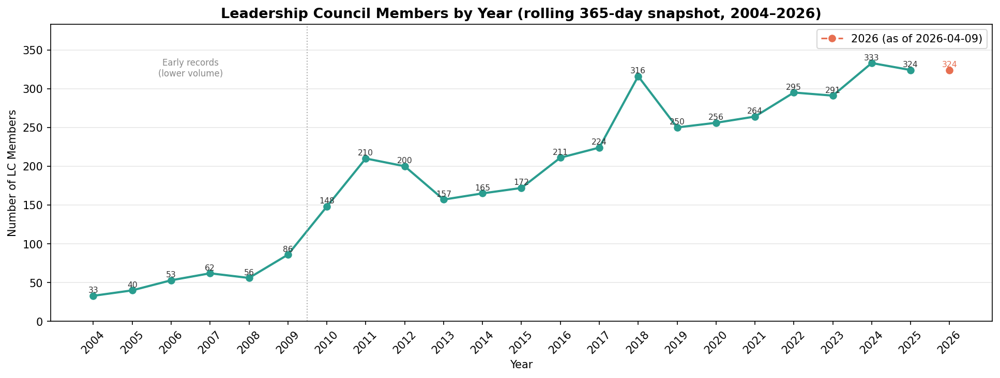

Each data point counts how many unique LC members gave at least once in the 365 days ending on that date. This rolling window gives a stable year-by-year picture of active membership without being distorted by any single event.

- LC membership grew from 33 in 2004 to a peak of **316 in 2018**, dipped during 2019–2021, then recovered to **333 in 2024**.
- The current count as of April 2026 is **324**.
- Early records (before ~2010) are incomplete and likely undercount actual membership — the post-2010 trend is more reliable.
- The 2019–2021 dip aligns with pandemic disruption; the strong recovery since 2022 suggests the LC base has stabilized at a new high.

---

## 3. Direct Mail Opportunity: People Without an Email Address

### The Question
How many people in the database can only be reached by mail — making direct mail our only option for proactive outreach?

### Approach

We built a four-step funnel, where each layer answers a distinct question:

```
All "Person" contacts in the database (79,830)
    ↓  Do they have a complete mailing address?
    ↓  Do they have no email on file?
    ↓  Have they not opted out of mail?
→  Core direct-mail-only audience
```

Each intermediate layer has its own value: the "complete address" count tells us our total direct mail capacity; the "no email" count tells us the full scope of our digital blind spot; the intersection gives us the actionable list.

For the address check, we required both a system-verified best address and confirmed that all address fields are filled in — not just a city name with no street.

### What We Found

| Metric | Count | Which means |
|--------|-------|---------------|
| Total "Person" contacts | 79,830 | Full database headcount |
| With a complete mailing address | 54,703 | All people who has a complete mailing address |
| No email on file | 19,319 | People who don't have email in our system |
| **Mailable + no email** | **16,440** | **Direct mail is the only way to reach them** |

### Chart

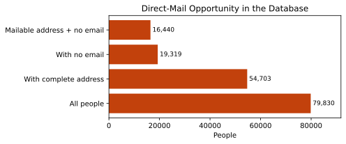

- 16,440 people cannot receive an email from us, we can only mail them for reaching out
- The gap between "no email" (19,319) and "mailable + no email" (16,440) shows that roughly 2,900 people have neither a usable email nor a complete mailing address 

---

## 4. New Contacts Since January: Postcard Outreach

### The Question
Among people added to the database since January 1, 2026, who has a complete mailing address but no email — and therefore needs a welcome postcard?

### Approach

Rather than mailing all 16,440 people at once, we slice by recency to create a smaller, time-sensitive list. New contacts are most receptive shortly after being added to the system. This query is also designed to be repeatable — update the start date each quarter and it automatically produces a fresh list.

### What We Found

6 people added since January 1, 2026, meet all criteria:

| Name | City | State | Date Added | Source |
|------|------|-------|------------|--------|
| Calderone, Dawna | Phoenix | AZ | 2026-03-30 | 26Sponsor |
| Melendez, Deanna | Prescott | AZ | 2026-02-26 | 2023 Direct Mail |
| Movahed, Reza | Tucson | AZ | 2026-02-26 | — |
| Bradford Coleman, Karyn | Little Rock | AR | 2026-01-19 | — |
| Figuroa, Lauren | Peoria | AZ | 2026-01-19 | — |
| Jewel, Jasmine | Flagstaff | AZ | 2026-01-19 | — |


### Chart & Export

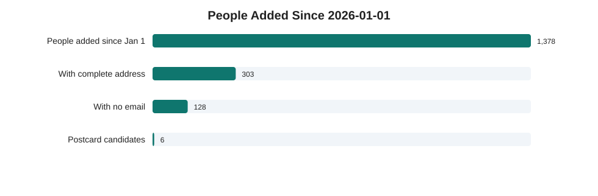

📄 **Export:** [people_added_since_january_postcard_outreach.csv](lapsed_donor_reactivation/people_added_since_january_postcard_outreach.csv)

- The current list has 6 people


---

## 5. Lapsed Donor Identification and Priority Tiering

### The Question
Which consistent donors have stopped giving? And among them, who should we prioritize for re-engagement outreach?

### Approach

We need to find truly high-quality donors, not those who make a single donation and then stop giving.
So we set up three qualification criteria here: 

**Criterion 1 — Consistency**
```
giving_years ≥ 3  AND  longest_streak ≥ 3
```
We require both because each catches a different failure mode:
- Giving years alone misses the person who gave in 2010, 2016, and 2024, technically 3 years, but no pattern.
- Streak alone misses the person who gave consistently for 3 years, stopped for 10, then gave once more.
Together, they identify people who built a genuine, unbroken giving habit.

**Criterion 2 — Lapse window**
```
Last donation between 1 and 5 years ago
```
Under 1 year: they might just be early in their annual cycle, which means they are not truly lapsed.
Over 5 years: the relationship has likely gone cold. Re-engagement cost is high, success rate is low. Out of scope for this campaign.

**Criterion 3 — High value**
```
At least one year with annual giving ≥ $250
```

To detect consecutive giving streaks, we used a mathematical pattern where a donor's giving years are compared against a sequential counter — any break in the sequence reveals a gap in giving. The longest unbroken run is then used as the streak length.

**Priority tier design — two dimensions crossed:**

|  | Lapsed ≤ 2 years | Lapsed 2–5 years |
|--|-----------------|-----------------|
| **High value ($250+)** | Tier 1 | Tier 2 |
| **Not high value** | Tier 3 | Tier 4 |

Value outranks recency in the ordering. A donor who gave $500/year for a decade and lapsed 4 years ago is a stronger re-engagement prospect than someone who gave $50/year for 3 years and lapsed 6 months ago, even though the latter is more recent.

### What We Found

| Tier | Definition | Count |
|------|------------|-------|
| Tier 1 | High value + lapsed ≤ 2 years | **85** |
| Tier 2 | High value + lapsed 2–5 years | **124** |
| Tier 3 | Not high value + lapsed ≤ 2 years | 54 |
| Tier 4 | Not high value + lapsed 2–5 years | 89 |
| **Total** | | **352** |

**Cohort profile:**

| Metric | Average |
|--------|---------|
| Years of giving | 7.4 years |
| Longest consecutive streak | 5.3 years |
| Lifetime giving amount | $3,044 |

209 of the 352 (59%) have at least one $250+ giving year. This is a strong signal that this cohort has real re-engagement potential.

### Chart & Exports

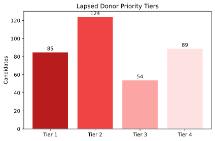

- 209 out of 352 lapsed donors (59%) have previously given $250 or more in a single year — these are high-value relationships worth investing in to recover.
- The average lapsed donor gave for 7.4 years with an average lifetime total of $3,044, indicating deep commitment before they stopped.
- Tier 1 (85 people) represents the most urgent opportunity: high-value donors who lapsed within the last 2 years, while the relationship is still relatively fresh.

📄 **Full candidate list:** [lapsed_consistent_donors.csv](lapsed_donor_reactivation/lapsed_consistent_donors.csv) — 352 rows  
📄 **High-value segment ($250+):** [lapsed_consistent_donors_250plus.csv](lapsed_donor_reactivation/lapsed_consistent_donors_250plus.csv) — 209 rows

---

## 6. Geographic Breakdown: Per-Donor Giving by State

### The Question
Where do our donors come from? How much does the typical donor give, and how does that vary by state?

### Approach

Total donation amount alone will always make AZ look dominant — it's where most of our donors live. But total dollars mix together two different things: how many donors a state has, and how much each person gives. To separate these, we use the **median** (the middle value for a typical donor) and the **IQR** (the range covering the middle 50% of donors) rather than simple averages, which are easily pulled up by a small number of very large gifts.

### What We Found

| State | Donors | Median lifetime giving |
|-------|--------|----------------------|
| Washington D.C. | 60 | ~$300 |
| New York | 30 | ~$200 |
| California | 175 | ~$175 |
| Colorado | 31 | ~$120 |
| Arizona | 6,935 | ~$100 |
| Washington, Illinois, Texas | 33–46 | ~$100 |
| Oregon | 33 | ~$80 |

### Chart

**Per-donor lifetime giving by state (median + IQR, states with 30+ donors):**

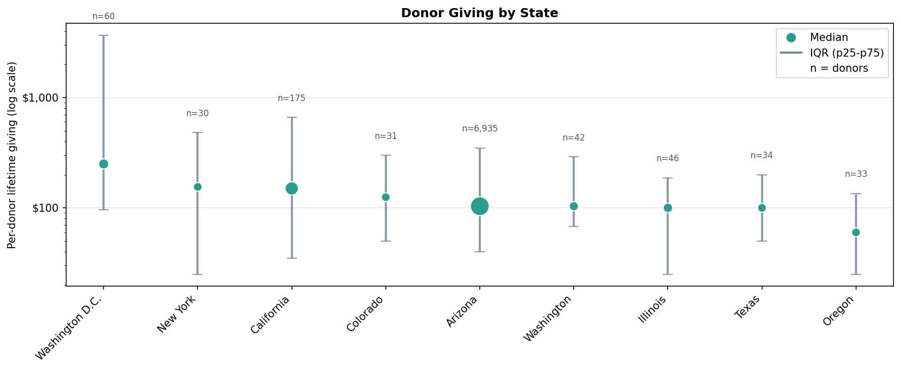

Each dot is the median for that state; the vertical line shows the middle 50% of donors; dot size reflects number of donors.

- **Washington D.C.** donors give the most per person (~$300 median), and the sample (60 donors) is large enough to be reliable.
- **Arizona** has by far the largest donor pool (6,935 donors) but a lower median, reflecting a wide base that includes many small-dollar donors.
- Out-of-state donors from DC, NY, and CA tend to give more per person than the typical Arizona donor — suggesting these are higher-capacity individuals worth cultivating.

---

## 7. Geographic Breakdown: Per-Donor Giving by ZIP Code

### The Question
Which ZIP codes have the highest total giving? And within those, which ones have the strongest per-donor giving capacity?

### Approach

We look at giving two ways: total dollars raised (to find our most active ZIP codes) and per-donor giving (to find where our highest-capacity donors live). Because a few very large gifts can skew totals, the per-donor chart uses winsorized averages (average after removing the top and bottom 5%) alongside the median.

### Charts

**Top 20 ZIP Codes by total contribution amount:**
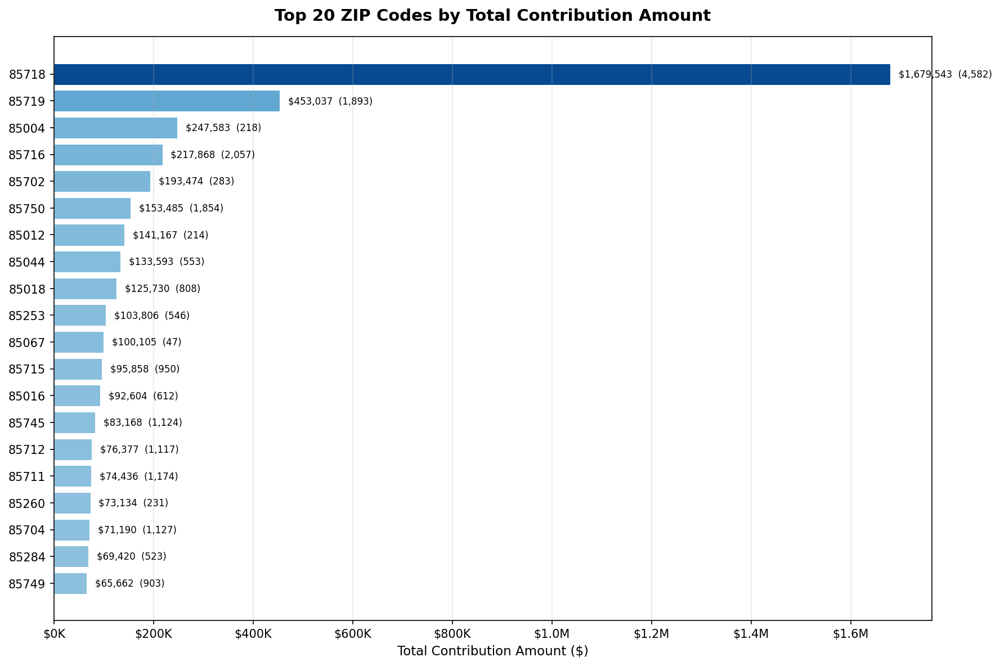

- ZIP **85718** (Tucson, Catalina Foothills) leads all ZIP codes with $1,679,543 — more than three times the second-place ZIP.
- The top five ZIP codes are all in the 857xx range, showing that giving is heavily concentrated in Tucson.

**Top 20 ZIP Codes (excluding Pam Grissom — founder, not counted as a regular donor):**
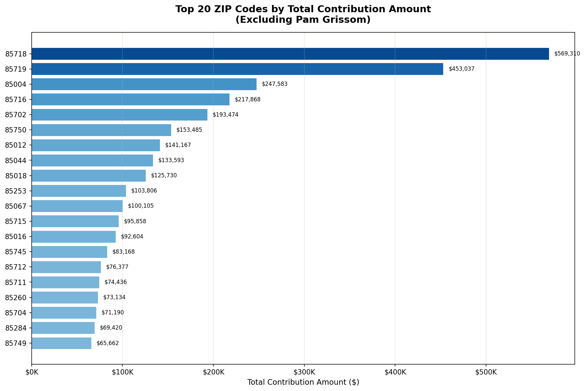

- After removing Pam Grissom's contributions, 85718 drops from $1.68M to $569K — meaning she alone accounted for over $1M from that ZIP code.

**Per-donor lifetime giving by ZIP code (top 20 by donor count):**
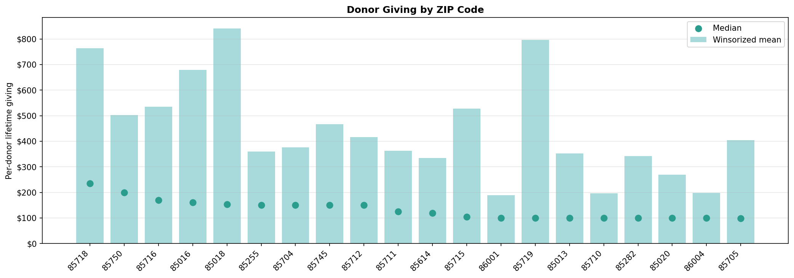

> **How to read this chart:** The green dot is the **median** — the middle value, unaffected by outliers. The bar is the **winsorized average** — the average after the top 5% and bottom 5% of gifts are removed. This prevents a single $100,000 donor from inflating the number for their entire ZIP code. When the bar is much taller than the dot, it means the ZIP still has a few very large donors even after trimming.

- **85718** (Tucson north) and **85750** (Tucson northeast) lead on both median and average — the most concentrated source of high-value donors.
- **85018** (Phoenix, Arcadia area) has the highest winsorized average (~$840), driven by a small number of very large donors.
- In nearly every ZIP code, the average is well above the median, confirming that a few large donors exist in almost every neighborhood.

**National donor location map:**
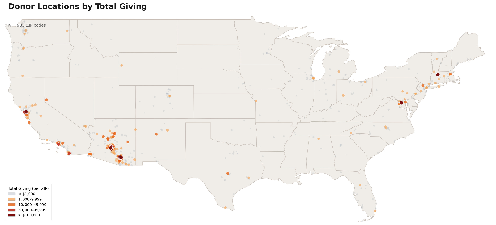

- Donors are spread across 925 ZIP codes nationwide but are heavily concentrated in the Tucson and Phoenix metro areas.
- A visible cluster on the East Coast (DC, MA, NY) matches the high per-donor giving seen in those states.

---

## 8. Geographic Breakdown: Per-Donor Giving by City and County

### The Question
How does giving vary across Arizona cities and counties, both in terms of total activity and the quality of individual donors?

### Charts

**Per-donor lifetime giving by city:**
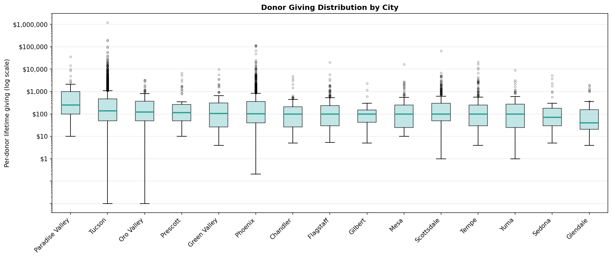

This box plot shows the full spread of lifetime giving for each city. The line in the middle of each box is the median; the box covers the middle 50% of donors; dots above are individual large donors (log scale).

- **Paradise Valley** has by far the highest median (~$250), with consistently high giving across the board.
- **Tucson** (2,682 donors) outperforms Phoenix on median giving (~$137 vs ~$100), despite being a similar type of city.
- **Glendale** has the lowest median (~$40), with many small-dollar donors.

**Per-donor lifetime giving by county — Arizona:**
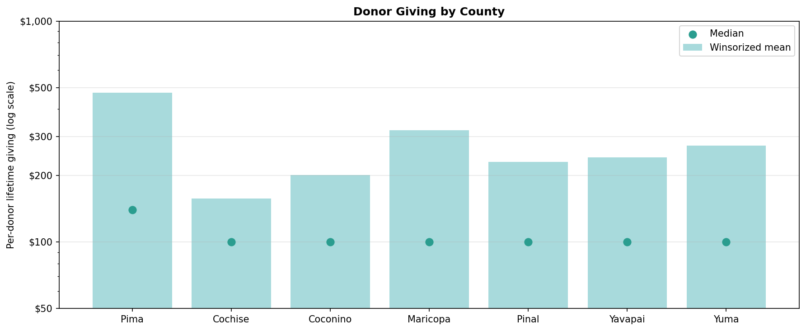

Bars are the winsorized average; green dots are the median.

- **Pima County** (Tucson area) has the highest median (~$140) and a large donor base — the strongest county overall.
- **Maricopa County** (Phoenix) has the most donors but a lower median (~$100), reflecting a broader and more varied donor base.
- All other counties cluster near $100 median, suggesting that $100 is the typical Arizona donor gift regardless of location.
- The gap between the bars and dots in every county shows that large donors exist everywhere — but they are most concentrated in Pima.

---

## 9. Donation Trends: Year-Over-Year Time Series

### The Question
How have donation amounts and donation counts trended over time in Arizona? Which years were peaks, and which were down years?

### Approach

We tracked two metrics in parallel — total dollar amount and total number of donations — because they can move in different directions. A year with fewer but larger donations looks very different from a year with more but smaller donations. 

Data is scoped to 2010–2026. Years before 2010 have sparse records.

### Charts

**Annual donation amount (line) and donation count (bar):**
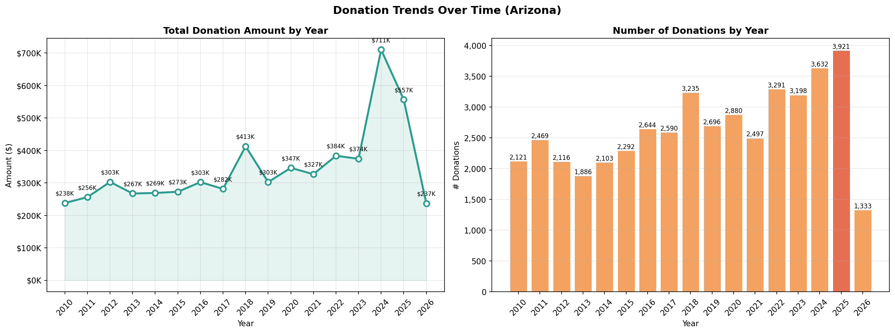


**Year-by-year summary table:**
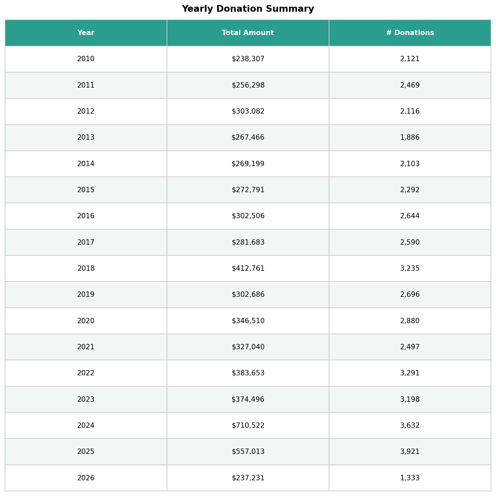

---

## 10. Top 10 Largest Individual & Organization Donations

### The Question
What are the largest single donations ever recorded in the database, and who made them?

### Approach

Pulled the top 10 rows from `contributions` ordered by amount descending, joined to `contacts` for donor details. Name display prioritizes the official organization name where available, then falls back to first and last name — to handle the mix of individual and organizational donors cleanly.

### Chart

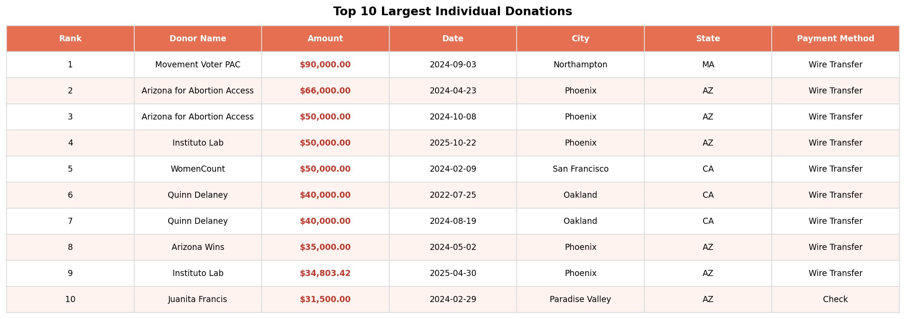

- The largest single donation is $90,000 from Movement Voter PAC.
- Arizona for Abortion Access appears twice (rank 2 and 3).

---

## Appendix: Exported Data Files

| File | Contents | Link |
|------|----------|------|
| `lapsed_consistent_donors.csv` | All lapsed donor candidates (352 rows) | [Open](lapsed_donor_reactivation/lapsed_consistent_donors.csv) |
| `lapsed_consistent_donors_250plus.csv` | High-value segment with $250+ giving history (209 rows) | [Open](lapsed_donor_reactivation/lapsed_consistent_donors_250plus.csv) |
| `people_added_since_january_postcard_outreach.csv` | New contacts since Jan 1 ready for postcard outreach (6 rows) | [Open](lapsed_donor_reactivation/people_added_since_january_postcard_outreach.csv) |

---

*Data source: PostgreSQL `arizona_list` database | Tools: Python (pandas, matplotlib, geopandas, SQLAlchemy, pgeocode)*
