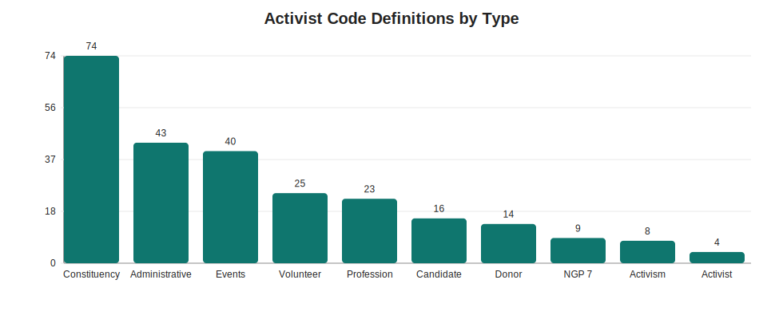
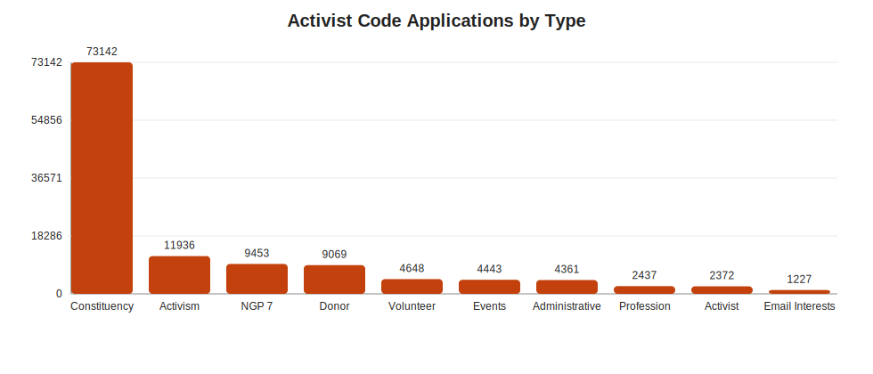
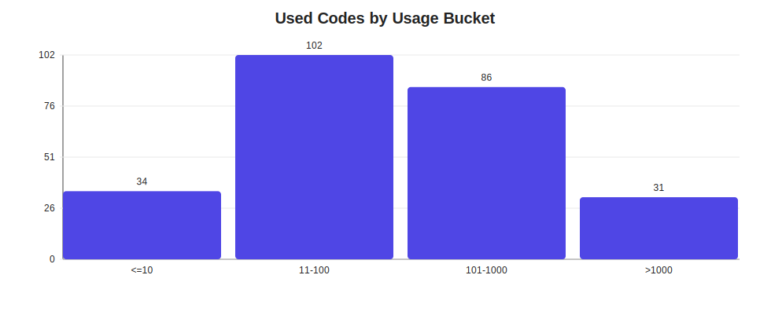
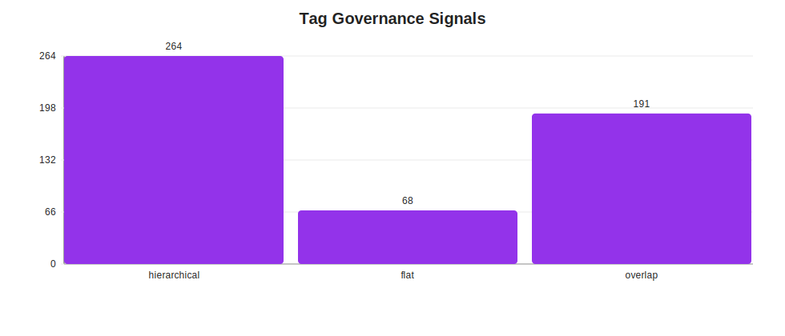

# Activist Codes Requirements Analysis

## Requirement Extraction

| requirement_id | business_need | why_it_matters | data_question |
| --- | --- | --- | --- |
| R1 | 建立 Activist Codes 的命名规范 | 上传更多名单之前，需要统一 label 规则，避免后续越积越乱。 | 现有 code 是否存在命名混乱、重复、不可扩展的问题？ |
| R2 | 明确 Activist Codes 与 Tags 的分工 | Linda 明确怀疑 Tags 之前没有正确使用。 | 哪些标签应该是 record-level code，哪些应该是 roll-up tag？ |
| R3 | 为上传名单建立多标签规则 | 例如 Maricopa County PCs 上传时，是否应该打两个 Activist Codes？ | 现有 code 体系是否支持“角色 + 地理 + 年份/来源”的组合标注？ |
| R4 | 清理重复和重叠 | 邮件明确提到 Tags 有 duplicate，且 Tags 与 Activist Codes 之间可能重叠。 | 现有 Activist Codes 是否已经出现重复、短名冲突、低价值存量？ |
| R5 | 建立后续可治理的体系 | 如果不先定规则，后续每次上传名单都会制造新的治理成本。 | 能否建立一张 canonical dictionary 和自动质检流程？ |

## Data Availability

| activist_code_definitions | activist_code_applications | distinct_applied_code_ids | distinct_applied_code_names | tag_definitions | duplicate_tag_name_groups | exact_tag_code_name_overlap |
| --- | --- | --- | --- | --- | --- | --- |
| 260 | 123962 | 253 | 252 | 332 | 1 | 191 |

Interpretation: both Activist Code and Tag data are now available, so duplicate and overlap cleanup can be evidence-based rather than hypothetical.

## Definitions by Type

| type | definition_count |
| --- | --- |
| Constituency | 74 |
| Administrative | 43 |
| Events | 40 |
| Volunteer | 25 |
| Profession | 23 |
| Candidate | 16 |
| Donor | 14 |
| NGP 7 | 9 |
| Activism | 8 |
| Activist | 4 |
| Email Interests | 3 |
| Organization | 1 |

## Applications by Type

| activistcodetype | application_count |
| --- | --- |
| Constituency | 73142 |
| Activism | 11936 |
| NGP 7 | 9453 |
| Donor | 9069 |
| Volunteer | 4648 |
| Events | 4443 |
| Administrative | 4361 |
| Profession | 2437 |
| Activist | 2372 |
| Email Interests | 1227 |
| Candidate | 846 |
| Organization | 28 |

Interpretation: Constituency dominates both the code catalog and actual usage, so audience grouping is already the main operational pattern.

## Short-Name Conflicts

| short | duplicate_count | long_names |
| --- | --- | --- |
| 201 | 10 | 2016 Canvassers | 2017 updated media l | 2012PimaPC | 2016ChoiceSigners | 2018 Womens March | 2019PhxWomensMarch | 2015 Match | 2017AnnualEvent | 2018AnnualEvent | 2019AnnualEvent |
| HRC | 6 | HRC 500-999 856-857 | HRC EList or PP | HRC1000plus 856-857 | HRC1000up not856-857 | HRC250Under 856-857 | HRC251to499 856-857 |
| NGP | 6 | NGP Delete | NGPClPhone | NGPDDCmbnd | NGPHmPhone | NGPHoushld | NGP-PrimarytoGeneral |
| 13P | 5 | 13PetBart | 13PetGun | 13PetiKirk | 13PetMilt | 13PetMove |
| DuV | 5 | DuVal2emai | DuValemail | DuValNEWAL | DuValProb2 | DuValProbN |
| AAA | 4 | AAA Active | AAA Initiative | AAA Training | AAA Website |
| For | 4 | Former Board Member | Former Staff | Former Candidate | Former Elected |
| Jan | 4 | 46024 | 46025 | 46026 | 46023 |
| Vol | 4 | VolCoordinator | VolFundraising | VolOfficeAsst | VolResearch |
| 202 | 3 | 2020PACSummerStaff | 2020AnnualEvent | 2020Volunteer |
| ELi | 3 | EList 2016 | EList2018 | EListAnnK |
| NCO | 3 | NCOA_2015-10-26 | NCOAUp2 | NCOAUpdate |
| 14E | 2 | 14Endorsed | 14Edwards |
| 16E | 2 | 16Elected | 16Endorsed |
| 18E | 2 | 18Elected | 18Endorsed |

Interpretation: short names have 32 duplicate groups, so they should not be used as canonical keys.

## Definition / Application Matching

| match_long_name | match_medium | match_short | distinct_applied_codes |
| --- | --- | --- | --- |
| 246 | 76 | 18 | 253 |

| activistcodetype | activistcodename |
| --- | --- |
| Administrative | Former Intern |
| Constituency | HRC EList or  PP |
| Constituency | January 2 |
| Constituency | January 3 |
| Constituency | January 4 |
| Constituency | January1 |
| Constituency | Juneteenth  2021 new |

Interpretation: long-name matching covers 97.23% of applied codes, which makes dictionary governance feasible, but a formal ID key is still needed.

## Unused Definitions

| total_defs | defs_seen_in_applied | defs_not_seen_in_applied |
| --- | --- | --- |
| 260 | 246 | 14 |

| type | long_name | medium | short |
| --- | --- | --- | --- |
| Activist | 26Student | 26Student | Stu |
| Administrative | Send Renewal | Send Rene | Sr |
| Constituency | 46023 | 46023 | Jan |
| Constituency | 46024 | 46024 | Jan |
| Constituency | 46025 | 46025 | Jan |
| Constituency | 46026 | 46026 | Jan |
| Constituency | HRC EList or PP | HRC EList | HRC |
| Constituency | Juneteenth 2021 new | Juneteent | Jun |
| Donor | AAADonor | AAADonor | 139 |
| Donor | AAADonorUS100+ | AAAUS100+ | 10+ |
| Donor | AAADonorUSLow | USLow | Low |
| Events | 24MayesLive | 24Mayes | KML |
| Events | 26NoKings | 26NoKings | 6NK |
| NGP 7 | NGP Delete | NGP Delet | NGP |

## Usage Concentration

| usage_bucket | code_count |
| --- | --- |
| <=10 | 34 |
| 11-100 | 102 |
| 101-1000 | 86 |
| >1000 | 31 |

Interpretation: top 10 codes account for 40.61% of all applications and top 20 codes account for 59.91%. Governance should focus first on high-frequency codes.

## Tags Audit

| total_tags | hierarchical_paths | path_equals_name | missing_description | duplicate_tag_name_groups | duplicate_tag_extra_rows | exact_name_overlap_with_activist_codes |
| --- | --- | --- | --- | --- | --- | --- |
| 332 | 264 | 68 | 120 | 1 | 1 | 191 |

| name | duplicate_count | ids |
| --- | --- | --- |
| EDU | 2 | 1021359 | 1021279 |

| name | path | description |
| --- | --- | --- |
| 12Endorsed | Candidates-Electeds/Endorsed/12Endorsed |  |
| 13MaricoPC | OLD Codes/2013/13MaricoPC | 2013 - 2014 Maricopa PCs |
| 13PetBart | OLD Codes/2013/13PetBart | 2013 Brenda Barton Petition |
| 13PetGun | OLD Codes/2013/13PetGun | 06-13 Gun Petition |
| 13PetMilt | OLD Codes/2013/13PetMilt | 2013 Military Sexual Assault Petition |
| 13PetMove | OLD Codes/2013/13PetMove | 13 Petition Barton Duplicate Move On membs |
| 13PetiKirk | OLD Codes/2013/13PetiKirk | 10-13 Kirkpatrick thank health care petition |
| 14Edwards | OLD Codes/2014/14Edwards | 2014 Donna Edwards event in Phx |
| 14Endorsed | Candidates-Electeds/Endorsed/14Endorsed | 2014 Endorsed Candidate |
| 14Movie | OLD Codes/2014/14Movie | 14Movie |
| 14PetSteel | OLD Codes/2014/14PetSteel | Petition for Victoria Steele??? |
| 15PetEdcut | OLD Codes/2015/15PetEdcut | Education Cuts Petetion May 2015 |
| 16 Phoenix Reception | Annual Events/16 Phoenix Reception |  |
| 16AZWomenSigners | Lists/16MandateEmails/16AZWomenSigners | AZ Women petition signers from Mandate Media |
| 16Elected | Candidates-Electeds/16Elected |  |
| 16Endorsed | Candidates-Electeds/Endorsed/16Endorsed |  |
| 16HillarySigners | Lists/16MandateEmails/16HillarySigners | Hillary petition signers from Mandate Media |
| 16OntheList | Candidates-Electeds/Endorsed/16OntheList |  |
| 16SADonor | Annual Events/16SADonor | Silent Auction Donors |
| 16TucsonLunch | Annual Events/16TucsonLunch |  |

Interpretation: 79.52% of tags are already hierarchical, while 57.53% have exact name overlap with Activist Codes. This supports using Tags as the hierarchy layer and cleaning the overlapping names.

## Upload Pattern Evidence

| type | long_name |
| --- | --- |
| Activist | Pima County 2024 PC |
| Constituency | 13MaricoPC |
| Constituency | 2012PimaPC |
| Constituency | CD 2 PCs 20160413 |
| Constituency | CD1PC20160412 |
| Constituency | PC 9-30-13 |
| Constituency | Pima Co PC 20171001 |
| NGP 7 | NGPClPhone |

| inputtype | application_count |
| --- | --- |
| Back End | 92703 |
| Bulk | 27134 |
| Website | 2041 |
| Manual | 1152 |
| Email Link | 932 |

Interpretation: multiple activist codes per uploaded list is consistent with the current system and workflow patterns.

## Recommended Data Science / Governance Solutions

| solution_id | recommendation | what_to_build | why_data_supports_it |
| --- | --- | --- | --- |
| S1 | 建立 canonical Activist Code dictionary | 新增一张主字典表，至少包含：code_id、canonical_long_name、type、purpose_class、status、owner、created_date、retired_date。 | 当前定义表没有可直接联结的 ID，只能靠名字匹配，后续治理风险高。 |
| S2 | 把 Activist Codes 设计成原子标签，而不是大杂烩 | 对上传名单使用多 code 规则，例如：Role=PC、Geo=MaricopaCounty、Year=2025、Source=Upload。 | Bulk/Back End 应用占绝对多数，且现有字典已存在 geography/PC 类 code，说明多标签模式是自然延伸。 |
| S3 | 把 Tags 重新定义为 roll-up 层 | 例如 `DemLeadership > PrecinctCommittee > CountyPCs` 这样的层级 Tag，用来汇总多个 Activist Codes。 | Tag 数据里 264/332 已经是分层 path，同时 191 个 tag 名称与 Activist Code 完全重叠，说明现在最需要的是角色分工而不是继续混用。 |
| S4 | 做重复/冲突检测 | 建立 short-name 冲突表、未使用定义表、未映射应用 code 表、相似名称候选表。 | short name 冲突已被实证验证，Tags 里也已发现 duplicate name 和大规模 tag/code overlap。 |
| S5 | 建立 upload-time code recommender | 根据上传文件名、来源、年份、地理区域、角色关键词，自动推荐应打哪些 Activist Codes 与 Tags。 | 邮件里的场景高度规则化，例如 `Maricopa County PCs` 这种文件名本身就能拆出角色 + 地理 + 年份。 |
| S6 | 做 code 生命周期管理 | 把 code 分成 Core / Managed / Legacy / Retired 四类，并做年度审计。 | 使用集中度很高，很多低频 code 不能和高频核心 code 一样管理。 |

## Direct Answer to the Email Thread

| question | answer |
| --- | --- |
| 上传 Maricopa County PCs 时，是否应该打两个 Activist Codes？ | 是，建议至少打两个原子 Activist Codes：一个表示角色/身份，一个表示地理。 |
| 推荐的 Activist Codes 组合是什么？ | 建议拆成 `Role: Precinct Committee`、`Geo: Maricopa County`，必要时再加 `Year: 2025` 或 `Source: Upload`。 |
| Tag 应该怎么用？ | Tag 不替代 Activist Codes，而是做 roll-up，例如 `DemLeadership > PCs`，把多个相关 Activist Codes 汇总起来。 |
| 当前最应该先做什么？ | 先冻结新命名规则，再清理 short-name 冲突、7 个未使用 code、1 个未映射应用 code，以及 `EDU` duplicate tag 和 191 个 tag/code 重叠项。 |

## Figures

