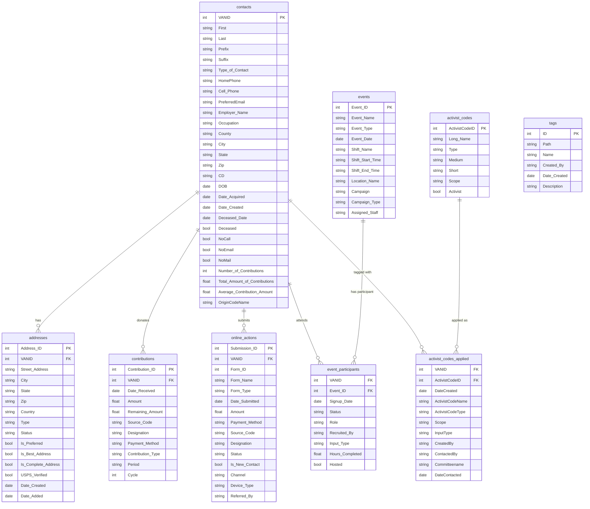

# EveryAction Database — ER Diagram & SQL Schema

## ER Diagram



---

## SQL Schema (DDL)

```sql
-- ============================================================
-- REFERENCE TABLES (no foreign keys)
-- ============================================================

CREATE TABLE activist_codes (
    activist_code_id    INT             NOT NULL,
    long_name           VARCHAR(255)    NOT NULL,
    type                VARCHAR(100),
    medium              VARCHAR(100),
    short               VARCHAR(50),
    scope               VARCHAR(50),
    activist            BOOLEAN,

    CONSTRAINT pk_activist_codes PRIMARY KEY (activist_code_id)
);

CREATE TABLE tags (
    id          INT             NOT NULL,
    path        VARCHAR(500),
    name        VARCHAR(255),
    created_by  VARCHAR(255),
    date_created DATE,
    description TEXT,

    CONSTRAINT pk_tags PRIMARY KEY (id)
);

-- ============================================================
-- CORE ENTITY
-- ============================================================

CREATE TABLE contacts (
    vanid                           INT             NOT NULL,
    first                           VARCHAR(100),
    last                            VARCHAR(100),
    mid                             VARCHAR(50),
    prefix                          VARCHAR(20),
    suffix                          VARCHAR(20),
    type_of_contact                 VARCHAR(50),
    home_phone                      VARCHAR(30),
    cell_phone                      VARCHAR(30),
    preferred_email                 VARCHAR(255),
    other_email                     VARCHAR(255),
    employer_name                   VARCHAR(255),
    occupation                      VARCHAR(255),
    county                          VARCHAR(100),
    city                            VARCHAR(100),
    state                           VARCHAR(10),
    zip                             VARCHAR(20),
    cd                              VARCHAR(50),
    dob                             DATE,
    date_acquired                   DATE,
    date_created                    DATE,
    deceased_date                   DATE,
    deceased                        BOOLEAN         DEFAULT FALSE,
    no_call                         BOOLEAN         DEFAULT FALSE,
    no_email                        BOOLEAN         DEFAULT FALSE,
    no_mail                         BOOLEAN         DEFAULT FALSE,
    number_of_contributions         INT             DEFAULT 0,
    total_amount_of_contributions   DECIMAL(12,2)   DEFAULT 0,
    average_contribution_amount     DECIMAL(10,2),
    origin_code_name                VARCHAR(255),

    CONSTRAINT pk_contacts PRIMARY KEY (vanid)
);

-- ============================================================
-- DEPENDENT TABLES
-- ============================================================

CREATE TABLE addresses (
    address_id          INT             NOT NULL,
    vanid               INT             NOT NULL,
    street_address      VARCHAR(500),
    city                VARCHAR(100),
    state               VARCHAR(10),
    zip                 VARCHAR(20),
    country             VARCHAR(50),
    type                VARCHAR(50),
    status              VARCHAR(50),
    is_preferred        BOOLEAN         DEFAULT FALSE,
    is_best_address     BOOLEAN         DEFAULT FALSE,
    is_complete_address BOOLEAN         DEFAULT FALSE,
    usps_verified       BOOLEAN         DEFAULT FALSE,
    date_created        DATE,
    date_added          DATE,

    CONSTRAINT pk_addresses     PRIMARY KEY (address_id),
    CONSTRAINT fk_addr_contact  FOREIGN KEY (vanid)
                                REFERENCES contacts(vanid)
                                ON DELETE CASCADE
);

CREATE TABLE contributions (
    contribution_id     INT             NOT NULL,
    vanid               INT             NOT NULL,
    date_received       DATE,
    amount              DECIMAL(10,2),
    remaining_amount    DECIMAL(10,2),
    source_code         VARCHAR(255),
    designation         VARCHAR(255),
    payment_method      VARCHAR(100),
    contribution_type   VARCHAR(100),
    period              VARCHAR(50),
    cycle               INT,

    CONSTRAINT pk_contributions     PRIMARY KEY (contribution_id),
    CONSTRAINT fk_contrib_contact   FOREIGN KEY (vanid)
                                    REFERENCES contacts(vanid)
                                    ON DELETE CASCADE
);

CREATE TABLE online_actions (
    submission_id       INT             NOT NULL,
    vanid               INT             NOT NULL,
    form_id             INT,
    form_name           VARCHAR(255),
    form_type           VARCHAR(100),
    date_submitted      DATE,
    amount              DECIMAL(10,2),
    payment_method      VARCHAR(100),
    source_code         VARCHAR(255),
    designation         VARCHAR(255),
    status              VARCHAR(50),
    is_new_contact      BOOLEAN         DEFAULT FALSE,
    channel             VARCHAR(100),
    device_type         VARCHAR(100),
    referred_by         VARCHAR(255),

    CONSTRAINT pk_online_actions    PRIMARY KEY (submission_id),
    CONSTRAINT fk_online_contact    FOREIGN KEY (vanid)
                                    REFERENCES contacts(vanid)
                                    ON DELETE CASCADE
);

CREATE TABLE events (
    event_id            INT             NOT NULL,
    event_name          VARCHAR(255),
    event_type          VARCHAR(100),
    event_date          DATE,
    shift_name          VARCHAR(255),
    shift_start_time    TIME,
    shift_end_time      TIME,
    location_name       VARCHAR(255),
    campaign            VARCHAR(255),
    campaign_type       VARCHAR(100),
    assigned_staff      VARCHAR(255),

    CONSTRAINT pk_events PRIMARY KEY (event_id)
);

CREATE TABLE event_participants (
    vanid               INT             NOT NULL,
    event_id            INT             NOT NULL,
    signup_date         DATE,
    status              VARCHAR(50),
    role                VARCHAR(100),
    recruited_by        VARCHAR(255),
    input_type          VARCHAR(100),
    hours_completed     DECIMAL(5,2),
    hosted              BOOLEAN         DEFAULT FALSE,

    CONSTRAINT pk_event_participants    PRIMARY KEY (vanid, event_id),
    CONSTRAINT fk_ep_contact            FOREIGN KEY (vanid)
                                        REFERENCES contacts(vanid)
                                        ON DELETE CASCADE,
    CONSTRAINT fk_ep_event              FOREIGN KEY (event_id)
                                        REFERENCES events(event_id)
                                        ON DELETE CASCADE
);

CREATE TABLE activist_codes_applied (
    vanid               INT             NOT NULL,
    activist_code_id    INT             NOT NULL,
    date_created        DATE            NOT NULL,
    activist_code_name  VARCHAR(255),
    activist_code_type  VARCHAR(100),
    scope               VARCHAR(50),
    input_type          VARCHAR(100),
    created_by          VARCHAR(255),
    contacted_by        VARCHAR(255),
    committee_name      VARCHAR(255),
    date_contacted      DATE,

    CONSTRAINT pk_activist_codes_applied    PRIMARY KEY (vanid, activist_code_id, date_created),
    CONSTRAINT fk_aca_contact               FOREIGN KEY (vanid)
                                            REFERENCES contacts(vanid)
                                            ON DELETE CASCADE,
    CONSTRAINT fk_aca_code                  FOREIGN KEY (activist_code_id)
                                            REFERENCES activist_codes(activist_code_id)
                                            ON DELETE RESTRICT
);
```

---

## Model Assumptions

- A CONTACT can register as an Individual or an Organization. Every CONTACT is uniquely identified by a VANID.
- A CONTACT can have zero or many ADDRESSes, but only one address can be designated as the preferred address at a time. A CONTACT can have zero addresses if no address has been entered.
- A CONTACT can have zero or many phone numbers. Phone numbers (home, cell, work) are stored as attributes of the CONTACT rather than as a separate table.
- A CONTACT can make zero or many CONTRIBUTIONs, and a CONTRIBUTION must belong to one and only one CONTACT. A CONTRIBUTION cannot exist without an associated CONTACT.
- A CONTACT can submit zero or many ONLINE_ACTIONs, and an ONLINE_ACTION must be submitted by one and only one CONTACT. An ONLINE_ACTION may optionally include a monetary amount (e.g., online donation).
- A CONTACT can participate in zero or many EVENTs, and an EVENT can be attended by zero or many CONTACTs. Each participation activity must have and only have one EVENT_PARTICIPANTS record, identified by the composite key (VANID, Event_ID).
- An EVENT can have zero or many EVENT_PARTICIPANTS. An EVENT can exist in the system before any CONTACT has signed up (zero participants).
- A CONTACT can be tagged with zero or many ACTIVIST_CODEs, and an ACTIVIST_CODE can be applied to zero or many CONTACTs. Each application is recorded in ACTIVIST_CODES_APPLIED, identified by the composite key (VANID, ActivistCodeID, DateCreated). The same code can be applied to the same CONTACT more than once on different dates.
- An ACTIVIST_CODE must exist in the ACTIVIST_CODES reference table before it can be applied to a CONTACT. Deleting an ACTIVIST_CODE is restricted if it has been applied to any CONTACT. Note: `long_name` is not unique — two distinct codes share the name "Candidate" (ActivistCodeID 4991254 and 5431273, differing in type and scope).
- TAGS are stored as a standalone reference table for internal labeling and categorization. TAGS have no direct foreign key relationship to other tables in this dataset; their association with contacts is recorded as a pipe-delimited string in ONLINE_ACTIONS and is not normalized.
- A CONTACT carries denormalized contribution summary statistics (number, total, and average contribution amount) directly on the CONTACTS record as pre-computed aggregates derived from the CONTRIBUTIONS table.
- A CONTACT can be flagged with communication suppression attributes (NoCall, NoEmail, NoMail) independently of one another.

---

## Validation Notes

| Check | Result | Detail |
|-------|--------|--------|
| `contacts.VANID` — uniqueness | ✅ PASS | 80,892 rows, all unique |
| `contributions.Contribution_ID` — uniqueness | ✅ PASS | 53,024 rows, all unique |
| `addresses.Address_ID` — uniqueness | ✅ PASS | 95,057 rows, all unique |
| `online_actions.Submission_ID` — uniqueness | ✅ PASS | 10,434 rows, all unique |
| `events.Event_ID` — uniqueness | ✅ PASS | 483 distinct events extracted from 27,276 participant rows |
| FK: `contributions.VANID` → `contacts` | ✅ PASS | 3 orphans / 7,772 (0.04%) |
| FK: `addresses.VANID` → `contacts` | ✅ PASS | 3 orphans / 74,160 (0.00%) |
| FK: `activist_codes_applied.VANID` → `contacts` | ✅ PASS | 2 orphans / 73,657 (0.00%) |
| FK: `event_participants.VANID` → `contacts` | ✅ PASS | 1 orphan / 11,287 (0.01%) |
| FK: `online_actions.VANID` → `contacts` | ✅ PASS | 1 orphan / 4,645 (0.02%) |
| `activist_codes_applied` — composite PK | ✅ UPDATED | PK is now `(VANID, ActivistCodeID, DateCreated)`; FK references `activist_codes(activist_code_id)` |
| `activist_codes` — primary key | ✅ UPDATED | PK changed from `long_name` to `activist_code_id` (integer); `long_name` is non-unique — two codes share the name "Candidate" |
| `tags` — foreign key linkage | ⚠️ NOTE | No direct FK to other tables; `online_actions.Activist_Codes` stores pipe-delimited names (not normalized) |

---

## Schema Changes (April 2026)

### Fix 1 — Circular FK removed (`contacts.address_id`)
`contacts.address_id` and its foreign key constraint `fk_contact_preferred_addr` have been dropped. The circular dependency between `contacts` and `addresses` is resolved. To retrieve a contact's preferred address, query `addresses` directly:
```sql
SELECT * FROM addresses WHERE vanid = :vanid AND is_preferred = TRUE LIMIT 1
```

### Fix 2 — Deduplication view for donation totals (`contributions_full`)
`online_actions` donation records (where `amount > 0`) overlap with `contributions` — 4,910 of 4,943 online donations appear in both tables. A view `contributions_full` has been created that unions both tables while excluding duplicates. **Always use `contributions_full` when computing total donation amounts** to avoid double-counting.
```sql
-- 53,053 rows, $7,950,992 total (vs contributions alone: 53,020 rows, $7,947,093)
SELECT COUNT(*), SUM(amount) FROM contributions_full
```

### Fix 3 — Denormalized fields corrected (`contacts`)
5 contacts had `total_amount_of_contributions` and/or `number_of_contributions` out of sync with the `contributions` table. All 5 records have been corrected. Zero discrepancies remain.

### Fix 5 — `activist_codes` primary key changed to `activist_code_id`
`long_name` was the original PK but is not unique: two distinct codes share the name "Candidate" (ActivistCodeID 4991254 and 5431273, differing in type and scope). The PK has been changed to `activist_code_id` (integer, sourced from EveryAction). The FK in `activist_codes_applied` and its composite PK have been updated accordingly. `contacts.address_id` (orphaned column from the removed circular FK) has also been dropped from the schema.

### Fix 4 — `tags` table documented as unlinked
A table comment has been added to `tags` marking it as unlinked. Tag-to-contact associations were not included in the EveryAction data export. The table exists as a reference but cannot be used for contact-level queries.
