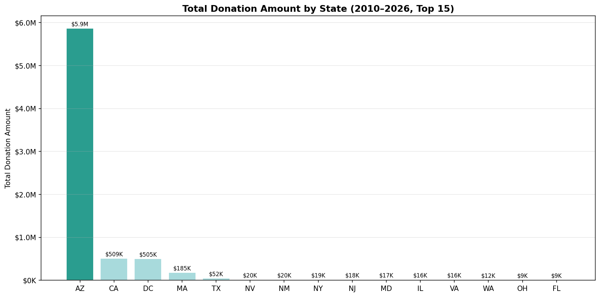
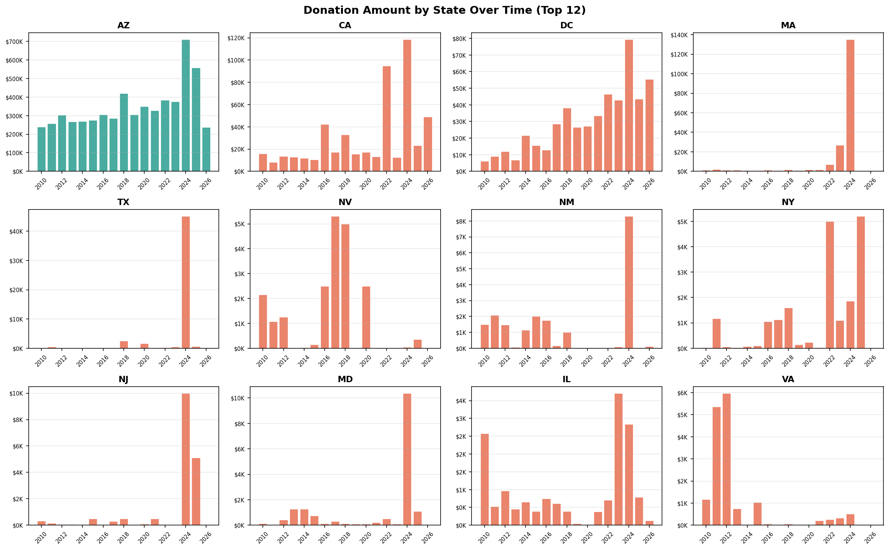
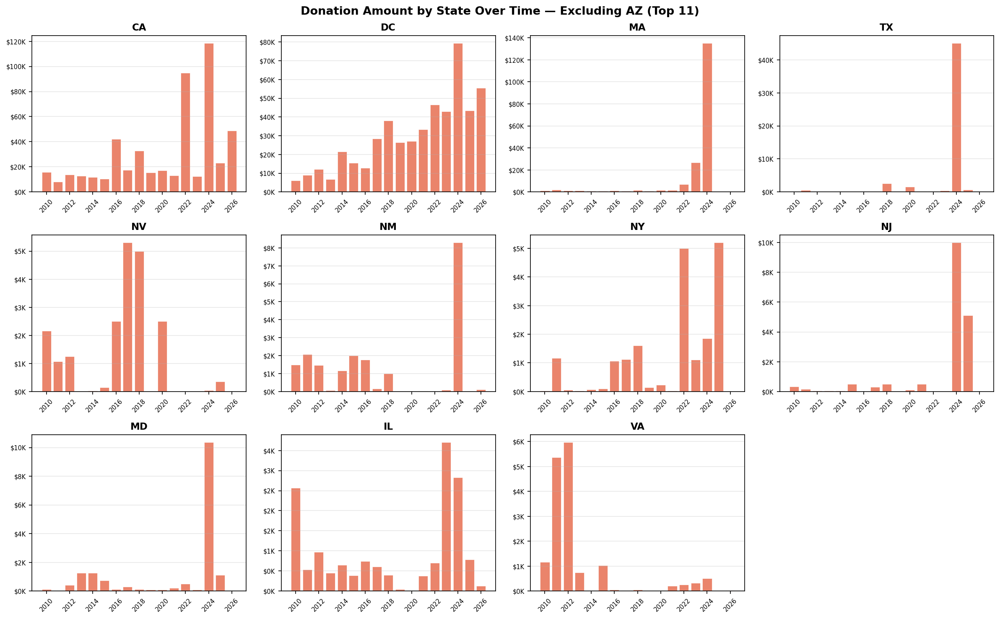
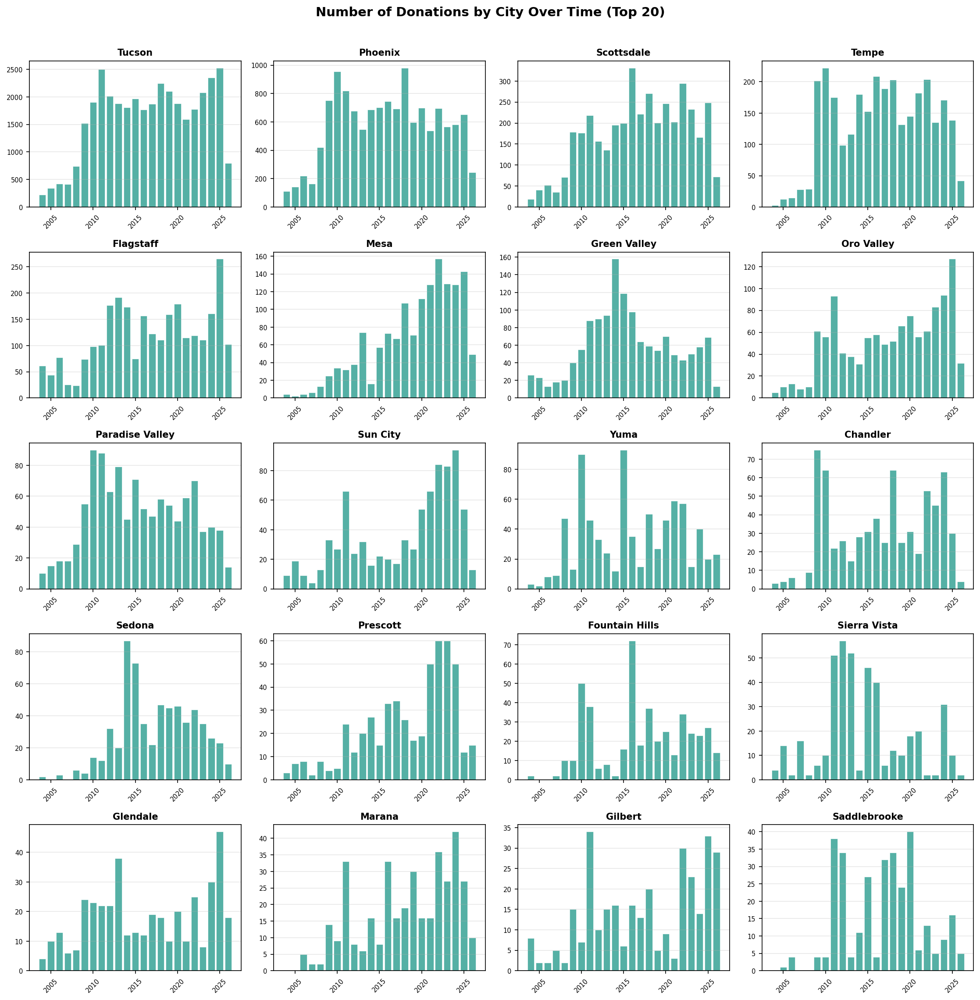
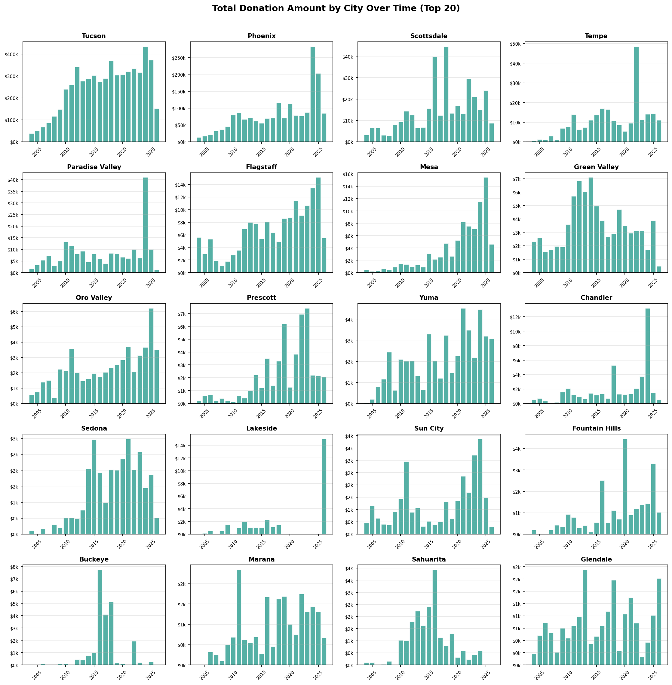
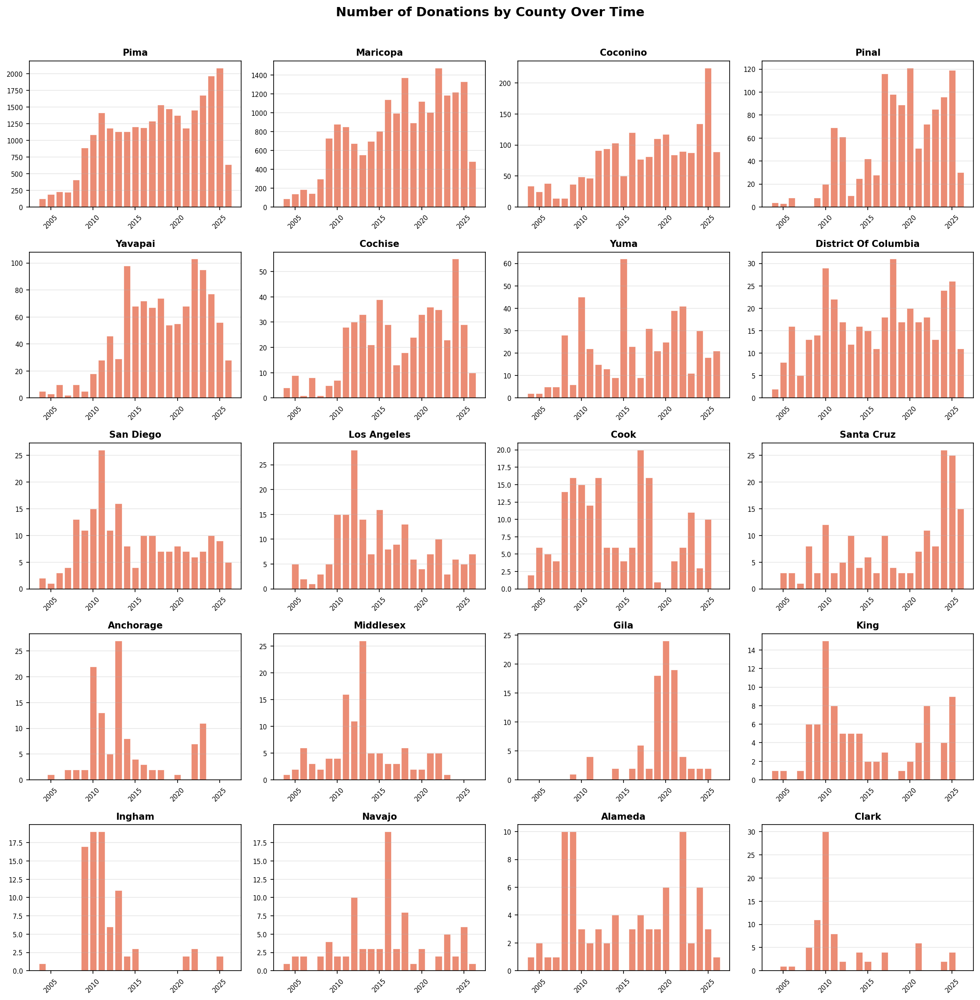
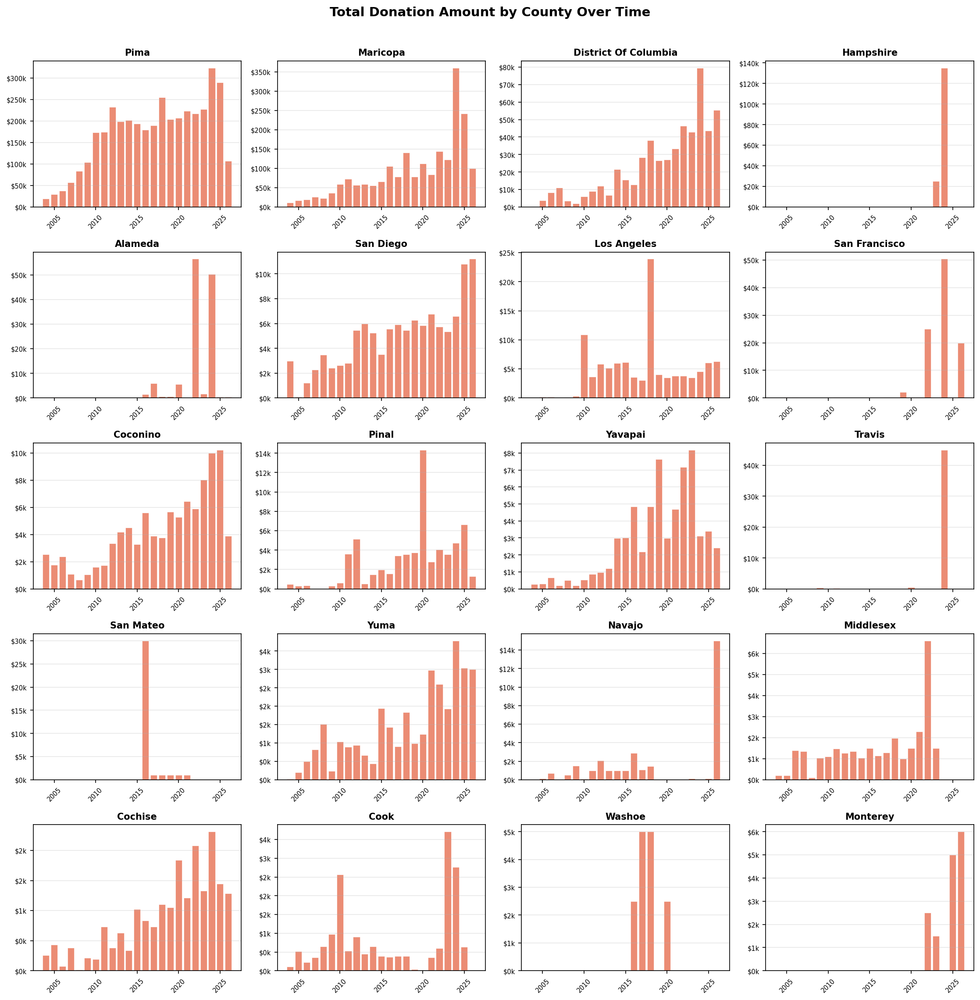
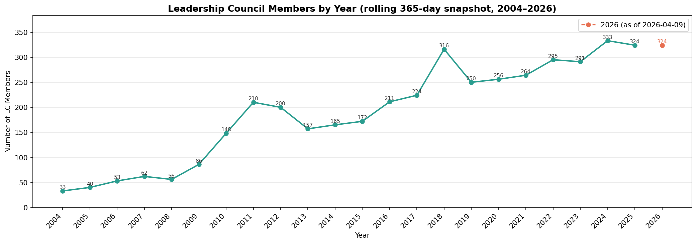

# Geographic Donation Analysis Report

**Date:** May 5, 2026
**Data source:** Arizona List EveryAction database
**Scope:** 7,770 donors, 7,704 with location data, covering 2004–2026

> **A note on the numbers:** A small number of very large gifts can make averages misleading. Most donors give between $40 and $350 over their lifetime, but a few have given over $10,000. For this reason, the per-donor charts use the **median** (the middle value) and the **IQR** (the range covering the middle 50% of donors) rather than simple averages. Groups with fewer than 30 donors are flagged — their numbers are less reliable.

---

## 1. Donor Location Map

Donors are spread across 925 ZIP codes nationwide, but the map makes the concentration clear: the vast majority are in Arizona, centered on the Tucson and Phoenix metro areas. Outside Arizona, the strongest clusters appear along the East Coast — especially the Washington D.C. area — and in California. Most dots outside Arizona are small, reflecting a limited but present national presence.

---

## 2. Donation Trends Over Time (Arizona)

Arizona donations from 2010 to 2026 show two clear patterns:

**Total amount raised** stayed relatively flat between $238K and $303K from 2010 to 2017, then jumped to $413K in 2018. After a dip, it climbed steadily to a peak of **$711K in 2024** — nearly triple the 2010 level. 2025 came in at $557K, which is still the second-highest year on record. The 2026 figure ($237K) reflects only part of the year.

**Number of donations** followed a similar path. Donation counts grew from around 2,100 per year in 2010 to a record **3,921 in 2025**, showing that growth came from both more donors giving and larger individual gifts.

| Year | Total Amount | # Donations |
|------|-------------|-------------|
| 2010 | $238,307 | 2,121 |
| 2018 | $412,761 | 3,235 |
| 2022 | $383,653 | 3,291 |
| 2024 | $710,522 | 3,632 |
| 2025 | $557,013 | 3,921 |
| 2026 (partial) | $237,231 | 1,333 |

---

## 3. Total Donations by State (2010–2026)

Arizona accounts for **$5.9 million** in total donations — far more than any other state. California ($509K) and Washington D.C. ($505K) are a distant second and third, followed by Massachusetts ($185K) and Texas ($52K). All other states are below $25K each. This chart captures raw totals, which are heavily shaped by the number of donors in each state — Arizona simply has far more donors than anywhere else.

---

## 4. Donation Trends by State Over Time

The first chart shows all top states including Arizona. Because Arizona's scale is so large, the second chart removes Arizona to show the out-of-state picture more clearly.

**Key patterns across out-of-state donors:**

- **California** has grown steadily and hit a peak of ~$120K in 2024, driven by a small number of large gifts.
- **Washington D.C.** shows consistent year-over-year growth since 2017, reaching ~$80K in 2024. It is the most reliable out-of-state donor base.
- **Massachusetts** shows an extreme spike in 2024 (~$135K), almost entirely driven by a single $90K wire transfer from Movement Voter PAC. Without that gift, MA would be much smaller.
- **Texas** was nearly inactive until a large single gift pushed it to ~$45K in 2024.
- Most other states (NV, NM, NY, NJ, MD, IL, VA) show small, irregular activity with occasional spikes in 2024, suggesting the 2024 election cycle brought in a wave of one-time out-of-state contributions.

---

## 5. Per-Donor Giving by State

This chart compares how much the **typical donor** gives over their lifetime, by state. Each dot is the median for that state; the vertical line shows the range covering the middle 50% of donors. Dot size reflects number of donors.

| State | Donors | Median lifetime giving |
|-------|--------|----------------------|
| Washington D.C. | 60 | ~$300 |
| New York | 30 | ~$200 |
| California | 175 | ~$175 |
| Colorado | 31 | ~$120 |
| Arizona | 6,935 | ~$100 |
| Washington, Illinois, Texas | 33–46 | ~$100 |
| Oregon | 33 | ~$80 |

Washington D.C. donors give the most on a per-person basis, and the sample (60 donors) is large enough to trust that number. Arizona's large donor pool comes with a lower median, meaning the base is wide but includes many smaller donors. Out-of-state donors from DC, NY, and CA tend to give more per person than the typical Arizona donor.

---

## 6. Donation Activity by City Over Time (Arizona, Top 20)

These two charts show how donation volume and total dollars have changed year by year across the top 20 Arizona cities.

**Tucson and Phoenix** lead by a wide margin in both donation count and total dollars, and both show upward trends through 2024–2025. **Scottsdale** has grown noticeably in recent years on both metrics. **Paradise Valley** stands out on the amount chart despite its small donor count — a sign that its donors give larger individual gifts. **Green Valley** shows a dip in recent years for both count and amount, suggesting some donor softening there. Most smaller cities (Flagstaff, Mesa, Chandler, Gilbert) show relatively steady counts with modest growth.

---

## 7. Per-Donor Giving by City (Arizona, Top 15 by Donor Count)

This box plot shows the full spread of lifetime giving for each city. The line in the middle of each box is the median; the box covers the middle 50% of donors; dots above the boxes are outliers.

| City | Median giving | Notes |
|------|--------------|-------|
| **Paradise Valley** | ~$250 | Highest median by far; consistently high givers |
| **Tucson** | ~$137 | Largest donor base (2,682); outperforms Phoenix |
| **Oro Valley** | ~$120 | Stable, mid-level giving |
| **Prescott, Green Valley** | ~$100–$120 | Steady donors, few outliers |
| **Phoenix** | ~$100 | Second-largest base (1,429 donors) |
| **Chandler, Flagstaff, Gilbert** | ~$90–$100 | |
| **Glendale** | ~$40 | Lowest median; many small-dollar donors |

Paradise Valley donors give at a level well above every other Arizona city. Tucson outperforms Phoenix on a per-donor basis even though both cities have similar medians — Tucson's distribution is shifted slightly higher. The log scale on the Y-axis is necessary; without it, the few $100,000+ donors in Tucson and Phoenix would flatten everyone else into a single line at the bottom.

---

## 8. Donation Activity by County Over Time (Arizona)

**Pima County** (Tucson area) and **Maricopa County** (Phoenix area) dwarf all other counties in both donation count and total dollars. Both show strong growth through 2024. Outside Arizona, **District of Columbia** and **Alameda County (CA)** appear in the amount chart, driven by a small number of large gifts rather than many donors.

Other Arizona counties (Coconino, Pinal, Yavapai, Cochise, Yuma) are active but at a much smaller scale, with most showing fairly steady counts and occasional peaks tied to election years.

---

## 9. Per-Donor Giving by County (Arizona)

Each bar is the winsorized average (average after removing the top and bottom 5% of gifts); each green dot is the median. All counties with at least 30 donors are shown.

| County | Median | Winsorized avg | Notes |
|--------|--------|---------------|-------|
| **Pima** | ~$140 | ~$490 | Highest median; most reliable data |
| **Maricopa** | ~$100 | ~$310 | Largest donor pool |
| **Coconino** | ~$100 | ~$200 | Flagstaff area |
| **Cochise** | ~$100 | ~$165 | |
| **Pinal, Yavapai, Yuma** | ~$100 | $225–$285 | |

Every county sits at roughly $100 median — suggesting that $100 is the typical lifetime gift regardless of where in Arizona a donor lives. Pima County is the one clear exception, with a meaningfully higher median of $140. The gap between median and winsorized average in each county reflects a small number of large donors pulling the average up.

---

## 10. Top 20 ZIP Codes by Total Donations

ZIP code **85718** (Tucson, Catalina Foothills area) leads all ZIP codes with **$1,679,543** in total donations from 4,582 transactions — more than three times the second-place ZIP. The second chart removes contributions from Pam Grissom, which brings 85718's total down to $569,310 and makes the comparison between ZIP codes more balanced.

After removing that single donor, **85718 and 85719** (both in Tucson's north-central area) are clearly the top two ZIP codes. The rest of the top 20 are a mix of Tucson and Phoenix neighborhoods, with totals ranging from $65K to $247K.

---

## 11. Per-Donor Giving by ZIP Code (Arizona, Top 20 by Donor Count)

This chart looks at the top ZIP codes by donor count, and measures how much the typical donor in each one gives over their lifetime. Bars are the winsorized average; green dots are the median.

Top-performing ZIP codes by median giving:

| ZIP | Median | Winsorized avg | Area |
|-----|--------|---------------|------|
| **85718** | ~$240 | ~$770 | Tucson — Catalina Foothills |
| **85750** | ~$200 | ~$500 | Tucson — northeast |
| **85716** | ~$165 | ~$535 | Tucson — central |
| **85016** | ~$165 | ~$685 | Phoenix — Biltmore area |
| **85018** | ~$150 | ~$840 | Phoenix — Arcadia area |

The winsorized average is well above the median in nearly every ZIP code, confirming that a few large donors exist in almost every neighborhood. Tucson's north ZIP codes (85718, 85750) perform well on both the median and the average, making them the most concentrated source of high-value donors.

---

## 12. Top 10 Largest Individual Donations

All 10 of the largest individual donations were made by wire transfer. The top gift — $90,000 from Movement Voter PAC in September 2024 — accounts for a large share of Massachusetts's total. Arizona for Abortion Access made two large gifts totaling $116,000, both in 2024.

| Rank | Donor | Amount | Date | Location |
|------|-------|--------|------|----------|
| 1 | Movement Voter PAC | $90,000 | 2024-09-03 | Northampton, MA |
| 2 | Arizona for Abortion Access | $66,000 | 2024-04-23 | Phoenix, AZ |
| 3 | Arizona for Abortion Access | $50,000 | 2024-10-08 | Phoenix, AZ |
| 4 | Instituto Lab | $50,000 | 2025-10-22 | Phoenix, AZ |
| 5 | WomenCount | $50,000 | 2024-02-09 | San Francisco, CA |
| 6–7 | Quinn Delaney | $40,000 × 2 | 2022, 2024 | Oakland, CA |
| 8 | Arizona Wins | $35,000 | 2024-05-02 | Phoenix, AZ |
| 9 | Instituto Lab | $34,803 | 2025-04-30 | Phoenix, AZ |
| 10 | Juanita Francis | $31,500 | 2024-02-29 | Paradise Valley, AZ |

Seven of the top 10 gifts came in 2024, which helps explain why that year's total was so much higher than any previous year. The only individual (non-organizational) donor in the top 10 is Juanita Francis from Paradise Valley, reinforcing that ZIP code's standing as a high-value area.

---

## 13. Leadership Council Membership Over Time

The Leadership Council (LC) grew from just 33 members in 2004 to a peak of **316 in 2018**, dipped during 2019–2021, then recovered to **333 in 2024**. The current count as of April 2026 is **324**.

The overall trend is upward, but the path has not been steady:

- **2004–2009:** Slow early growth from 33 to 86 members.
- **2010–2012:** A sharp rise to 210, possibly tied to increased organizing activity.
- **2013–2015:** A drop back to 157–172, then a gradual recovery.
- **2018:** The all-time peak at 316 members.
- **2019–2021:** A decline to 250–264, likely reflecting the disruption of the pandemic years.
- **2022–2024:** A strong recovery to 333 by 2024, the second-highest level ever.
- **2026 (partial):** Holding at 324 as of April 9.

The early records (before ~2010) likely undercount actual membership due to incomplete data entry. For trend analysis, the post-2010 data is more reliable.

---

*This report was generated from Jupyter Notebook `geo_analysis_notebook.ipynb` using data exported from the Arizona List EveryAction database (as of April 9, 2026).*
