# Arizona List Datasets & Data Analysis Summary

## Before that, We want to say thanks to you all!
First, a big thank you to Arizona List for sharing your data and giving us this hands-on opportunity. We truly appreciate the trust. Also A big thank you to all Arizona List staffs for your patience, care, and support! It means a lot to have a team that genuinely invests in interns' growth.

And this analysis was put together using our data science background alongside AI assistance and vibe coding. Still a work in progress, but hoping this gives a useful first look at the data.

## Database

**Database:** PostgreSQL `arizona_list` (imported the data that memo sent to us)   
**Data Coverage:** 2004–2026

---

## Table of Contents

1. [Database Overview](#1-database-overview)
2. [Total Donors and Leadership Council Members](#2-total-donors-and-leadership-council-members)
3. [Direct Mail Opportunity: People Without an Email Address](#3-direct-mail-opportunity-people-without-an-email-address)
4. [New Contacts Since January: Postcard Outreach](#4-new-contacts-since-january-postcard-outreach)
5. [Lapsed Donor Identification and Priority Tiering](#5-lapsed-donor-identification-and-priority-tiering)
6. [Geographic Breakdown: State-Level Comparison](#6-geographic-breakdown-state-level-comparison)
7. [Geographic Breakdown: ZIP Code Heat Analysis](#7-geographic-breakdown-zip-code-heat-analysis)
8. [Geographic Trends: City and County Over Time](#8-geographic-trends-city-and-county-over-time)
9. [Donation Trends: Year-Over-Year Time Series](#9-donation-trends-year-over-year-time-series)
10. [Top 10 Largest Individual & Organization Donations](#10-top-10-largest-individual--organization-donations)

---

## 1. Database Overview

Before diving into any specific analysis, we need to understand what we're working with:
- how many records do we have?
- how many unique donors?
- and what time period does the data cover?

### Approach
This is a baseline data quality check. We counted total donation records, unique donors, and the date range of the data. The key distinction here is between counting records and counting people — one donor who gives 10 times appears as 10 records but still counts as 1 person.

### What We Found

| Metric | Value |
|--------|-------|
| Total contribution records | 53,020 |
| Unique donors | 7,769 |
| Earliest donation on record | January 15, 2004 |
| Most recent donation | April 9, 2026 |

Over 22 years of giving history — a strong foundation for longitudinal analysis.

---

## 2. Total Donors and Leadership Council Members

### The Question
How many people in the database are Leadership Council (LC) members, and what share of total donors do they represent?

### Approach

There is no single "LC member" field in the database. We searched across three separate data sources for any LC-related signals:

| Signal Source | Identifier | People |
|--------------|------------|--------|
| Activist codes | `19LCPin`, `20LCPin` | 248 (2019–2020 pin mailing tags) |
| Contribution source codes | Contains "LC" (e.g., `23TucsonLCBrief`, `25AprilLCPhx`) | 116 |
| Online action source codes | Contains "LC" | 95 |

We combined all three sources rather than relying on any single one, because each covers a different time period and workflow. The pin codes, for example, were only applied in 2019–2020 and would miss anyone who joined the LC after 2021. Anyone appearing in any of the three sources is counted as an LC member — no double-counting.

One known gap: records before 2019 are incomplete, so LC members who joined early and haven't engaged since may not appear in the data.

### What We Found

| Metric | Value |
|--------|-------|
| Total donors | 7,769 |
| Leadership Council members | 386 |
| LC as % of all donors | 5.0% |

The LC represents just 5% of the full donor base — an intentionally exclusive group. At the same time, that leaves over 7,300 regular donors who could potentially be cultivated toward LC membership.

### Chart

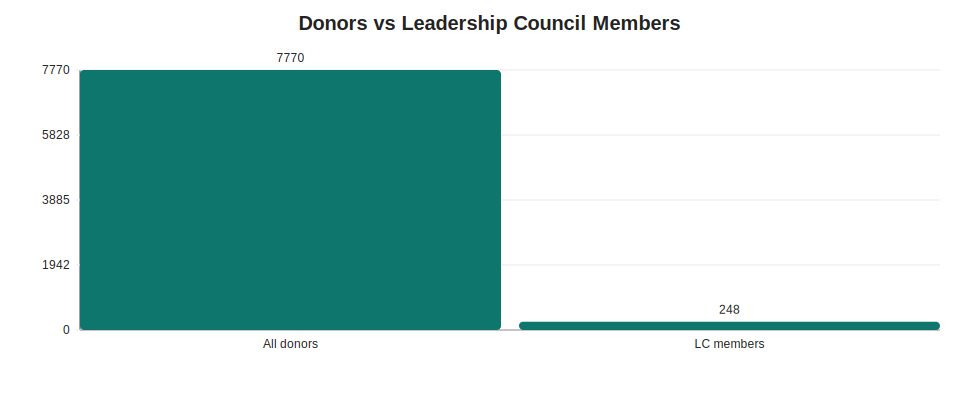

---

## 3. Direct Mail Opportunity: People Without an Email Address

### The Question
How many people in the database can only be reached by mail — making direct mail our only option for proactive outreach?

### Approach

We built a four-step funnel, where each layer answers a distinct question:

```
All "Person" contacts in the database (79,830)
    ↓  Do they have a complete mailing address?
    ↓  Do they have no email on file?
    ↓  Have they not opted out of mail?
→  Core direct-mail-only audience
```

Each intermediate layer has its own value: the "complete address" count tells us our total direct mail capacity; the "no email" count tells us the full scope of our digital blind spot; the intersection gives us the actionable list.

For the address check, we required both a system-verified best address and confirmed that all address fields are filled in — not just a city name with no street.

### What We Found

| Metric | Count | Which means |
|--------|-------|---------------|
| Total "Person" contacts | 79,830 | Full database headcount |
| With a complete mailing address | 54,703 | All people who has a complete mailing address |
| No email on file | 19,319 | People who don't have email in our system |
| **Mailable + no email** | **16,440** | **Direct mail is the only way to reach them** |

### Chart

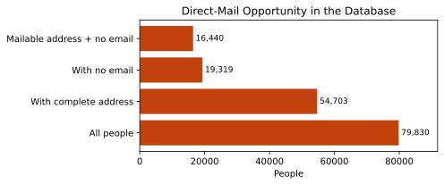

- 16,440 people cannot receive an email from us, we can only mail them for reaching out
- The gap between "no email" (19,319) and "mailable + no email" (16,440) shows that roughly 2,900 people have neither a usable email nor a complete mailing address 

---

## 4. New Contacts Since January: Postcard Outreach

### The Question
Among people added to the database since January 1, 2026, who has a complete mailing address but no email — and therefore needs a welcome postcard?

### Approach

Rather than mailing all 16,440 people at once, we slice by recency to create a smaller, time-sensitive list. New contacts are most receptive shortly after being added to the system. This query is also designed to be repeatable — update the start date each quarter and it automatically produces a fresh list.

### What We Found

6 people added since January 1, 2026, meet all criteria:

| Name | City | State | Date Added | Source |
|------|------|-------|------------|--------|
| Calderone, Dawna | Phoenix | AZ | 2026-03-30 | 26Sponsor |
| Melendez, Deanna | Prescott | AZ | 2026-02-26 | 2023 Direct Mail |
| Movahed, Reza | Tucson | AZ | 2026-02-26 | — |
| Bradford Coleman, Karyn | Little Rock | AR | 2026-01-19 | — |
| Figuroa, Lauren | Peoria | AZ | 2026-01-19 | — |
| Jewel, Jasmine | Flagstaff | AZ | 2026-01-19 | — |


### Chart & Export

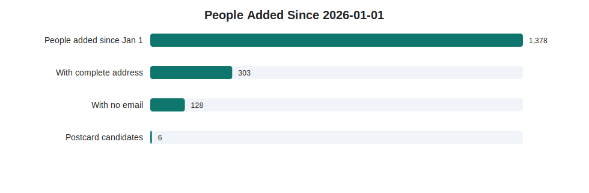

📄 **Export:** [people_added_since_january_postcard_outreach.csv](lapsed_donor_reactivation/people_added_since_january_postcard_outreach.csv)

- The current list has 6 people


---

## 5. Lapsed Donor Identification and Priority Tiering

### The Question
Which consistent donors have stopped giving? And among them, who should we prioritize for re-engagement outreach?

### Approach

We need to find truly high-quality donors, not those who make a single donation and then stop giving.
So we set up three qualification criteria here: 

**Criterion 1 — Consistency**
```
giving_years ≥ 3  AND  longest_streak ≥ 3
```
We require both because each catches a different failure mode:
- Giving years alone misses the person who gave in 2010, 2016, and 2024, technically 3 years, but no pattern.
- Streak alone misses the person who gave consistently for 3 years, stopped for 10, then gave once more.
Together, they identify people who built a genuine, unbroken giving habit.

**Criterion 2 — Lapse window**
```
Last donation between 1 and 5 years ago
```
Under 1 year: they might just be early in their annual cycle, which means they are not truly lapsed.
Over 5 years: the relationship has likely gone cold. Re-engagement cost is high, success rate is low. Out of scope for this campaign.

**Criterion 3 — High value**
```
At least one year with annual giving ≥ $250
```

To detect consecutive giving streaks, we used a mathematical pattern where a donor's giving years are compared against a sequential counter — any break in the sequence reveals a gap in giving. The longest unbroken run is then used as the streak length.

**Priority tier design — two dimensions crossed:**

|  | Lapsed ≤ 2 years | Lapsed 2–5 years |
|--|-----------------|-----------------|
| **High value ($250+)** | Tier 1 | Tier 2 |
| **Not high value** | Tier 3 | Tier 4 |

Value outranks recency in the ordering. A donor who gave $500/year for a decade and lapsed 4 years ago is a stronger re-engagement prospect than someone who gave $50/year for 3 years and lapsed 6 months ago, even though the latter is more recent.

### What We Found

| Tier | Definition | Count |
|------|------------|-------|
| Tier 1 | High value + lapsed ≤ 2 years | **85** |
| Tier 2 | High value + lapsed 2–5 years | **124** |
| Tier 3 | Not high value + lapsed ≤ 2 years | 54 |
| Tier 4 | Not high value + lapsed 2–5 years | 89 |
| **Total** | | **352** |

**Cohort profile:**

| Metric | Average |
|--------|---------|
| Years of giving | 7.4 years |
| Longest consecutive streak | 5.3 years |
| Lifetime giving amount | $3,044 |

209 of the 352 (59%) have at least one $250+ giving year. This is a strong signal that this cohort has real re-engagement potential.

### Chart & Exports

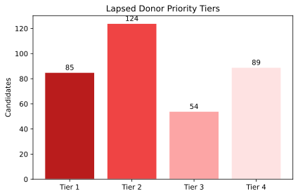

- 209 out of 352 lapsed donors (59%) have previously given $250 or more in a single year — these are high-value relationships worth investing in to recover.
- The average lapsed donor gave for 7.4 years with an average lifetime total of $3,044, indicating deep commitment before they stopped.
- Tier 1 (85 people) represents the most urgent opportunity: high-value donors who lapsed within the last 2 years, while the relationship is still relatively fresh.

📄 **Full candidate list:** [lapsed_consistent_donors.csv](lapsed_donor_reactivation/lapsed_consistent_donors.csv) — 352 rows  
📄 **High-value segment ($250+):** [lapsed_consistent_donors_250plus.csv](lapsed_donor_reactivation/lapsed_consistent_donors_250plus.csv) — 209 rows

---

## 6. Geographic Breakdown: State-Level Comparison

### The Question
Where do our donors come from? How does giving volume and donor quality vary by state?

### Approach

The original analysis only looked at Arizona. Expanding to all states opens up a more strategic question: which states represent high-potential audiences we may be underinvesting in?

Total donation amount alone will always make AZ look dominant — it's where most of our donors live. But average donation size measures something different: individual donor capacity. A state with 20 donors averaging $1,500 per donation tells a very different story than a state with 500 donors averaging $50.

Because AZ's total ($5.87M) is over 11x the next highest state ($509K), we produced two versions of the trend chart — one including AZ to show the full picture, and one excluding AZ so year-over-year movement in other states is actually visible.

### What We Found

| State | Total Amount | Number of Donations | Avg Donation Amount |
|-------|-------------|-------|----------|
| AZ | $5,868,051 | 45,229 | $130 |
| CA | $508,850 | 719 | $708 |
| DC | $505,244 | 317 | $1,594 |
| MA | $185,238 | 106 | $1,748 |
| TX | $51,534 | 58 | $889 |
| NV | $20,351 | 62 | $328 |

### Charts

**Top 15 states by total giving:**
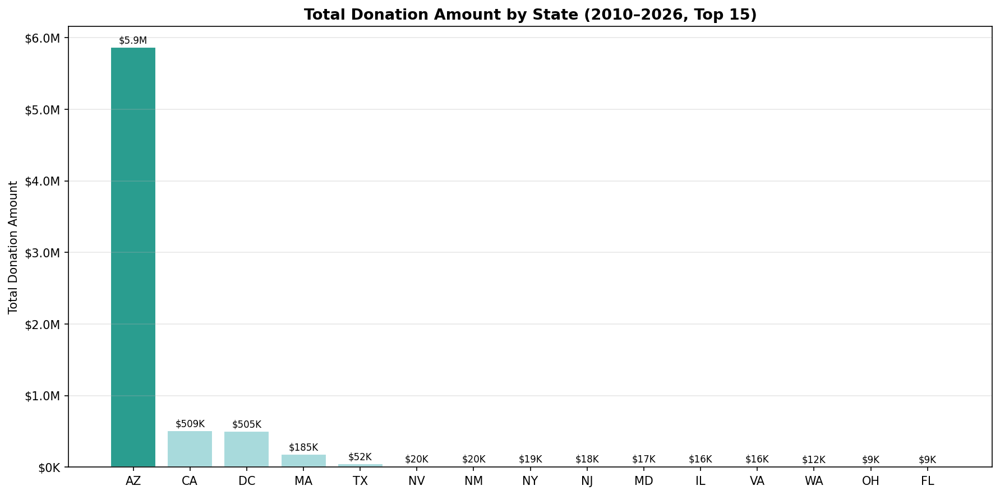

- Arizona dominates total volume with $5.87M, more than 11x the next highest state.
- California and DC are nearly tied on total amount ($509K vs $505K), but DC has far fewer donors (317 vs 719), meaning DC donors give significantly more per person.

**Year-over-year trends — top 12 states (including AZ):**
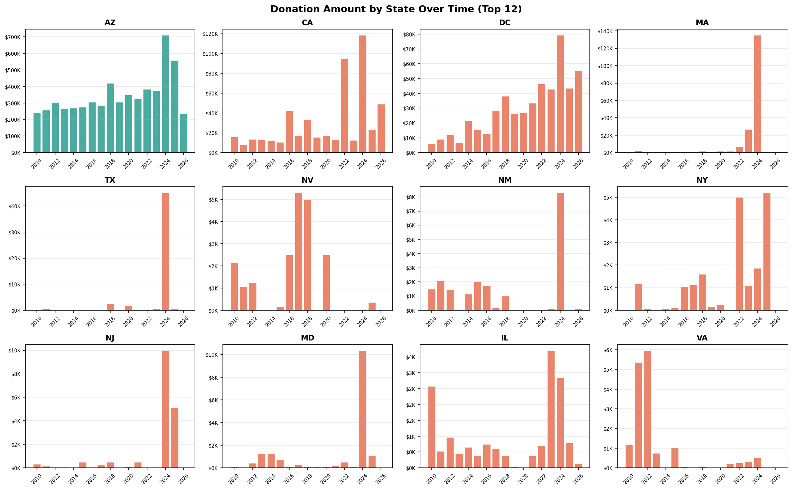

- AZ shows strong growth in 2024, reaching a record high of ~$700K.
- Most non-AZ states show concentrated spikes in 2023–2024, suggesting election-cycle driven giving rather than consistent year-round engagement.
- CA and DC have grown substantially since 2021, indicating expanding national reach.

---

## 7. Geographic Breakdown: ZIP Code Heat Analysis

### The Question
Which ZIP codes drive the most giving? And where are our donors located across the country?

### Approach

**① Top 20 ZIP Code bar chart**
Aggregates total amount and donation count by ZIP from PostgreSQL, ranks, and renders as a horizontal bar chart with inline annotations. Straightforward, useful for local field planning.

**② National donor location bubble map**
- Used `pgeocode` to convert ZIP codes to lat/lon coordinates
- Bubble size driven by log₁₀ of total giving — log scaling prevents a handful of very large ZIPs from visually overwhelming everything else
- Five color tiers from gray (< $1K) to deep red (≥ $100K)
- Base map from the Census Bureau TIGER/Line state boundary shapefiles

The map answers the question the bar chart can't: are we geographically concentrated, or do we have meaningful donor presence scattered across the country?

### Charts

**Top 20 ZIP Codes by total giving:**
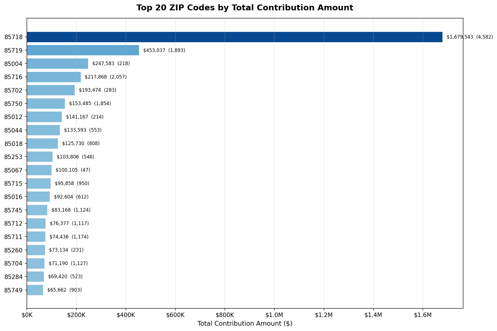

- The top five ZIP codes are all in the 857xx range, which shows that giving is heavily concentrated in Tucson rather than spread evenly across different cities.

**Top 20 ZIP Codes by total giving (excluding Pam Grissom — founder, not counted as donor):**
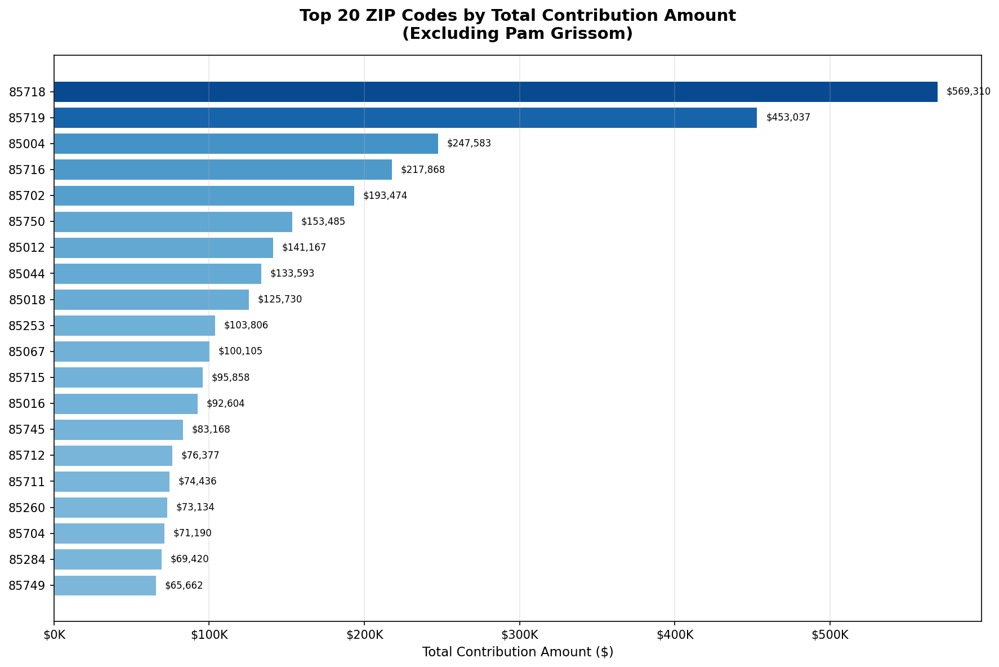

- After removing Pam Grissom's contributions, 85718 drops from $1.68M to $569K, which means Pam Grissom donated over 1M!


**National donor location map:**
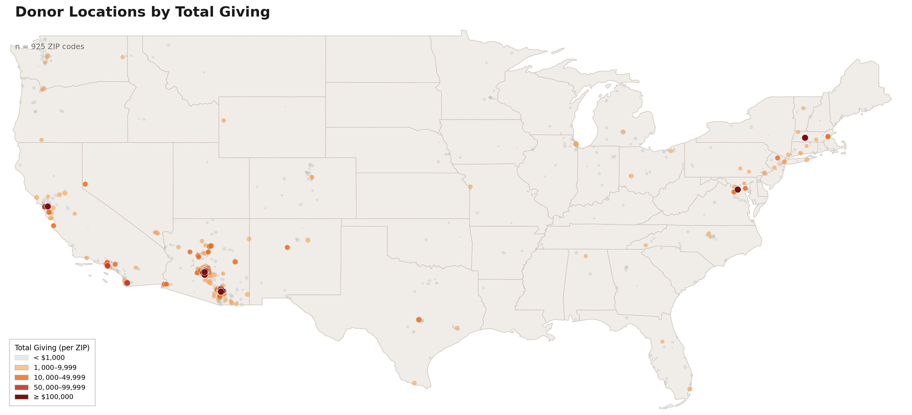

- The vast majority of donors are concentrated in southern Arizona, particularly in the Tucson and Phoenix metro areas.
- A meaningful cluster is visible on the East Coast (DC, MA, NY), consistent with the high average donation amounts seen in those states.

---

## 8. Geographic Trends: City and County Over Time

### The Question
How have donation patterns shifted across cities and counties year over year?

### Charts

**City over time — number of donations (top 20 cities):**
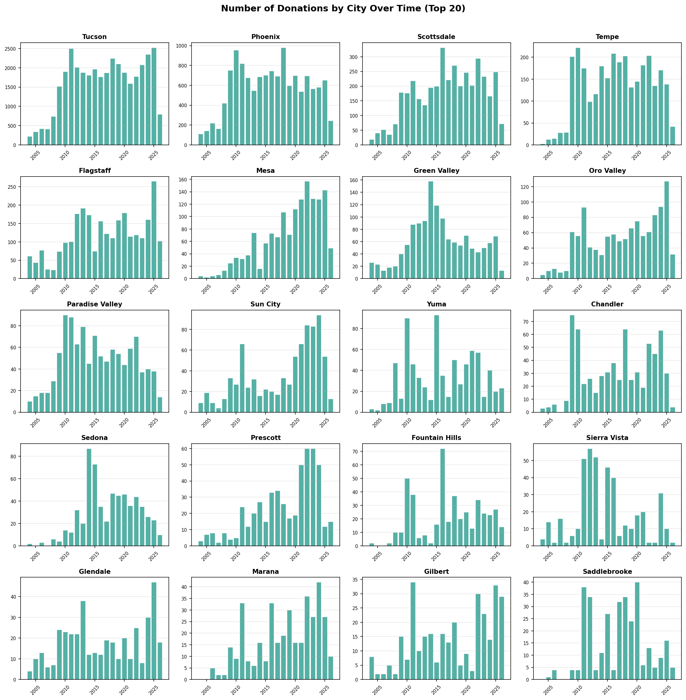

- Top 5 cities by total number of donations: Tucson 23,011 / Phoenix 8,603 / Scottsdale 2,776 / Tempe 2,022  / Flagstaff 1,665.

- Tucson consistently leads in donation volume, with Phoenix a distant second

**City over time — total amount (top 20 cities):**
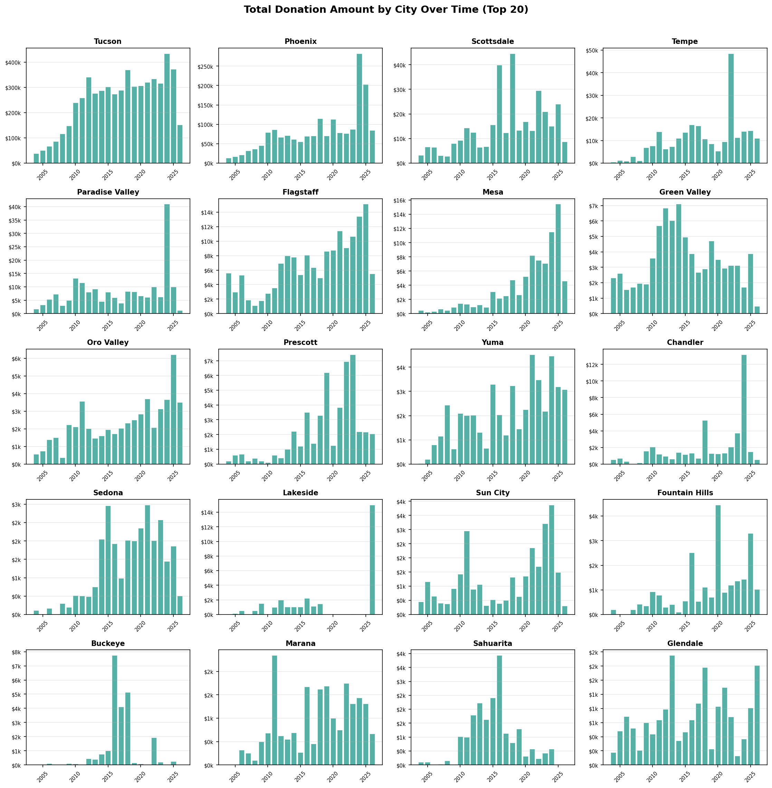

- Top 5 cities by total donation amount: Tucson $3,829,899 / Phoenix $1,357,111 / Scottsdale $243,473 / Tempe $154,897 / Flagstaff $90,231.
- Tucson and Phoenix dominate total dollar amounts, but Phoenix shows stronger growth in 2024–2025, narrowing the gap with Tucson.
- Paradise Valley stands out: relatively few donations but a sharp spike in amount in 2025, indicating a small number of very large donations from a wealthy area.
- Several mid-sized cities (Flagstaff, Mesa, Scottsdale) show consistent growth in total amount since 2020.
- Lakeside ranks 14th by total amount ($28,536) despite having only 5 donors and 56 donations. Two donors account for 99% of that total — one gave a single $15,000 donations in March 2026, another gave $13,375 across 42 donations from 2004–2018.

**County over time — number of donations (top 20 counties):**
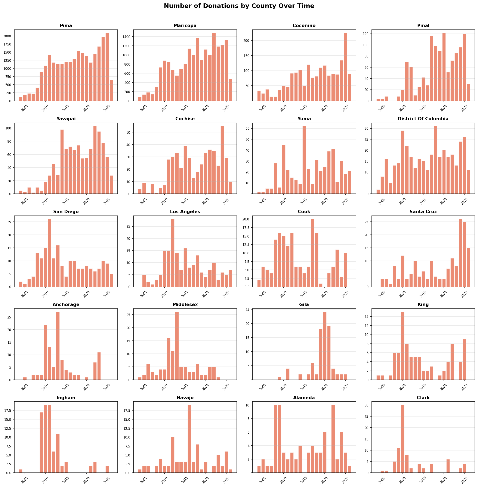

- Top 5 counties by number of donations : Pima 25,136 / Maricopa 18,278 / Coconino 1,810 / Pinal 1,155 / Yavapai 1,071.
- Pima County accounts for the overwhelming majority of donations by count, with Maricopa County in second.
- Most other counties contribute very small donation volumes, confirming that giving is highly concentrated in two metro areas.

**County over time — total amount (top 20 counties):**
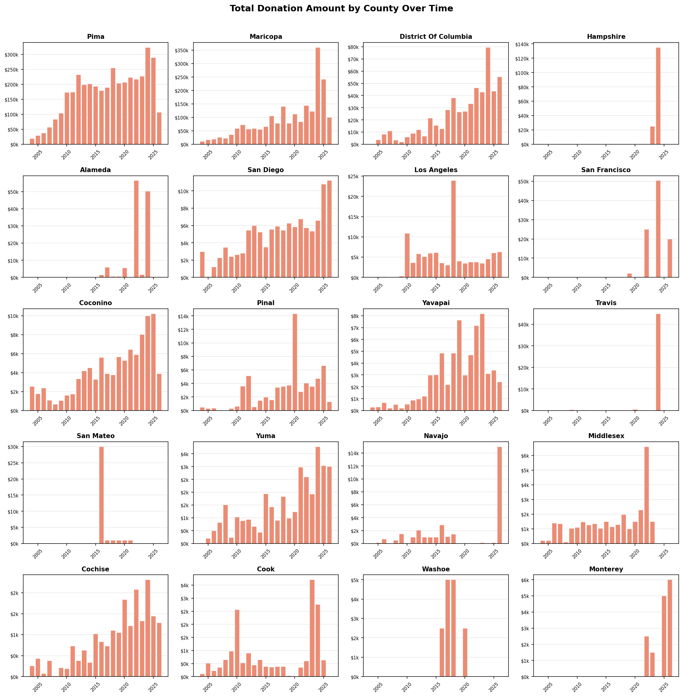

- Top 5 counties by total donation amount: Pima $3,933,821 / Maricopa $2,073,250 / District of Columbia $534,534 / Hampshire $160,180 / Alameda $124,943.
- Pima County leads total amount every year, but Maricopa County's share has grown steadily, suggesting Phoenix is becoming a more significant funding base.

---

## 9. Donation Trends: Year-Over-Year Time Series

### The Question
How have donation amounts and donation counts trended over time in Arizona? Which years were peaks, and which were down years?

### Approach

We tracked two metrics in parallel — total dollar amount and total number of donations — because they can move in different directions. A year with fewer but larger donations looks very different from a year with more but smaller donations. 

Data is scoped to 2010–2026. Years before 2010 have sparse records.

### Charts

**Annual donation amount (line) and donation count (bar):**
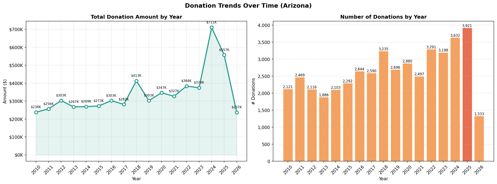


**Year-by-year summary table:**
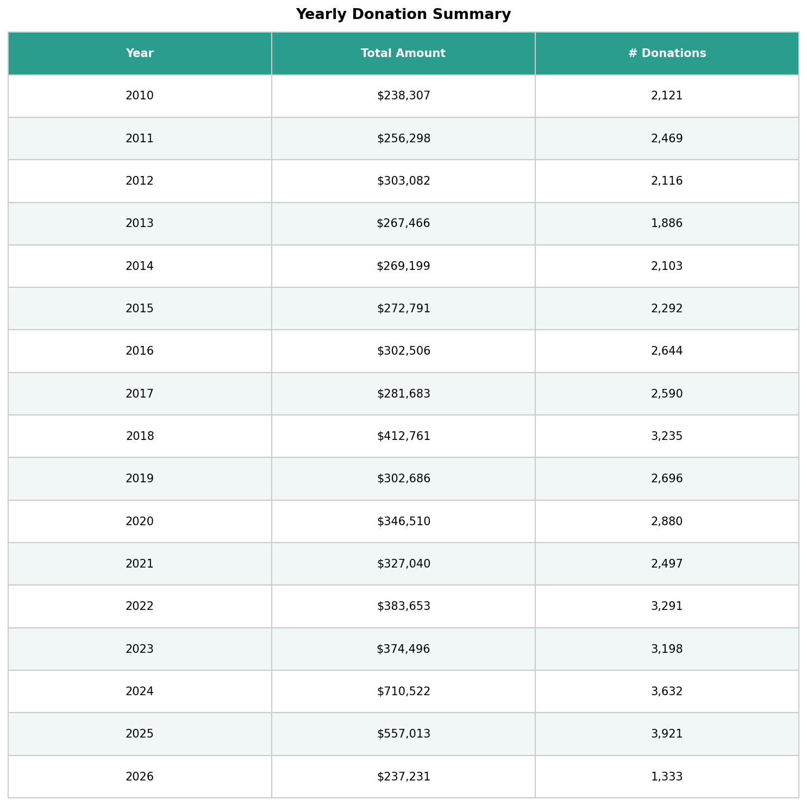

---

## 10. Top 10 Largest Individual & Organization Donations

### The Question
What are the largest single donations ever recorded in the database, and who made them?

### Approach

Pulled the top 10 rows from `contributions` ordered by amount descending, joined to `contacts` for donor details. Name display prioritizes the official organization name where available, then falls back to first and last name — to handle the mix of individual and organizational donors cleanly.

### Chart

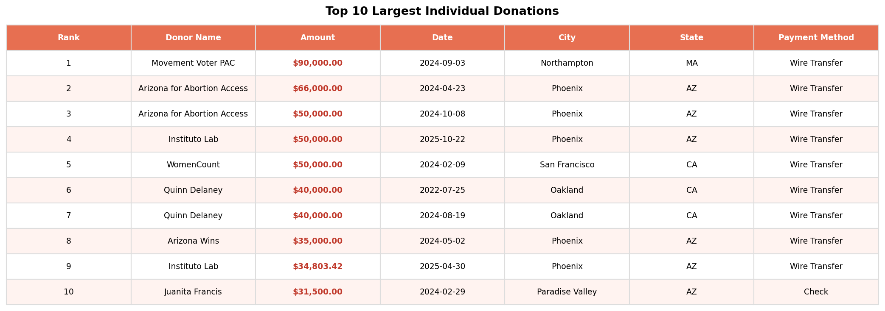

- The largest single donation is $90,000 from Movement Voter PAC.
- Arizona for Abortion Access appears twice (rank 2 and 3).

---

## Appendix: Exported Data Files

| File | Contents | Link |
|------|----------|------|
| `lapsed_consistent_donors.csv` | All lapsed donor candidates (352 rows) | [Open](lapsed_donor_reactivation/lapsed_consistent_donors.csv) |
| `lapsed_consistent_donors_250plus.csv` | High-value segment with $250+ giving history (209 rows) | [Open](lapsed_donor_reactivation/lapsed_consistent_donors_250plus.csv) |
| `people_added_since_january_postcard_outreach.csv` | New contacts since Jan 1 ready for postcard outreach (6 rows) | [Open](lapsed_donor_reactivation/people_added_since_january_postcard_outreach.csv) |

---

*Data source: PostgreSQL `arizona_list` database | Tools: Python (pandas, matplotlib, geopandas, SQLAlchemy, pgeocode)*
