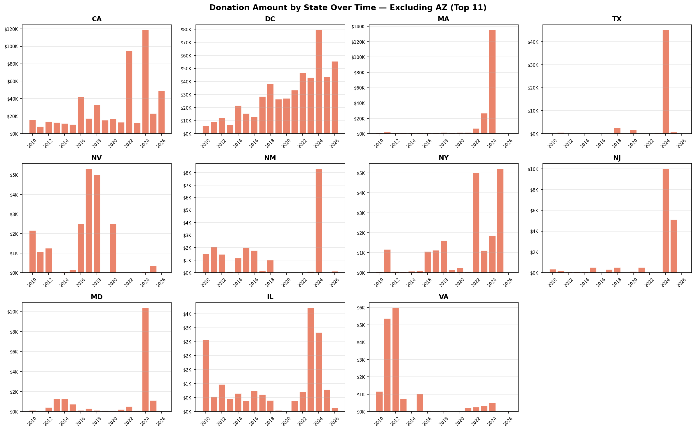

# Arizona List — Fundraising Data Analysis: Technical Summary

**Database:** PostgreSQL `arizona_list` (imported from EveryAction CRM)  
**Analysis Date:** April 20, 2026  
**Data Coverage:** 2004–2026

---

## Table of Contents

1. [Database Overview](#1-database-overview)
2. [Donor Universe vs. Leadership Council](#2-donor-universe-vs-leadership-council)
3. [Direct Mail Opportunity: People Without an Email Address](#3-direct-mail-opportunity-people-without-an-email-address)
4. [New Contacts Since January: Postcard Outreach](#4-new-contacts-since-january-postcard-outreach)
5. [Lapsed Donor Identification and Priority Tiering](#5-lapsed-donor-identification-and-priority-tiering)
6. [Geographic Breakdown: State-Level Comparison](#6-geographic-breakdown-state-level-comparison)
7. [Geographic Breakdown: ZIP Code Heat Analysis](#7-geographic-breakdown-zip-code-heat-analysis)
8. [Donation Trends: Year-Over-Year Time Series](#8-donation-trends-year-over-year-time-series)
9. [Top 10 Largest Individual Donations](#9-top-10-largest-individual-donations)

---

## 1. Database Overview

### The Question
Before diving into any specific analysis, we need to understand what we're working with — how many records do we have, how many unique donors, and what time period does the data cover?

### Approach
This is a baseline data quality check. Running it first ensures that every downstream analysis is grounded in a reliable picture of the data.

```sql
SELECT COUNT(*)                 AS contribution_rows,
       COUNT(DISTINCT co.vanid) AS distinct_donors,
       MIN(co.date_received)    AS first_gift,
       MAX(co.date_received)    AS latest_gift
FROM contributions co
JOIN contacts c ON co.vanid = c.vanid
```

### What We Found

| Metric | Value |
|--------|-------|
| Total contribution records | 53,020 |
| Unique donors | 7,769 |
| Earliest gift on record | January 15, 2004 |
| Most recent gift | April 9, 2026 |

Over 22 years of giving history — a strong foundation for longitudinal analysis.

---

## 2. Donor Universe vs. Leadership Council

### The Question
How many people in the database are Leadership Council (LC) members, and what share of total donors do they represent?

### Approach

**Step 1 — Figure out how LC membership is recorded.**
There's no single "LC member" field in the database. We searched across three tables for any LC-related signals:

| Signal Source | Identifier | People |
|--------------|------------|--------|
| Activist codes | `19LCPin`, `20LCPin` | 248 (2019–2020 pin mailing tags) |
| Contribution source codes | Contains "LC" (e.g., `23TucsonLCBrief`, `25AprilLCPhx`) | 116 |
| Online action source codes | Contains "LC" | 95 |

**Step 2 — Why union all three signals instead of just using the pin codes?**
The pin codes were applied as mailing list operation tags for thank-you letters in 2019 and 2020 — they were never meant to be a comprehensive LC membership list. Anyone who attended LC events after 2021 has no pin code on record but is clearly an LC member based on their donation source codes. The three signals cover different time periods and workflows, so they complement rather than duplicate each other.

**Step 3 — A note on data coverage before 2019.**
The `activist_codes_applied` table only goes back to September 2021. The earliest LC-related contribution source code is from July 2018. Anyone who joined the LC before 2019 and hasn't participated since is effectively invisible in this dataset — a known gap we can't close with the current data.

```sql
WITH lc_members AS (
    SELECT vanid FROM activist_codes_applied WHERE activist_code_name IN ('19LCPin', '20LCPin')
    UNION
    SELECT vanid FROM contributions WHERE lower(source_code) LIKE '%lc%'
    UNION
    SELECT vanid FROM online_actions WHERE lower(source_code) LIKE '%lc%'
)
SELECT
    (SELECT COUNT(DISTINCT vanid) FROM contributions WHERE amount > 0) AS total_donors,
    COUNT(DISTINCT vanid)                                               AS lc_members,
    ROUND(100.0 * COUNT(DISTINCT vanid) /
          (SELECT COUNT(DISTINCT vanid) FROM contributions WHERE amount > 0), 1) AS lc_pct_of_donors
FROM lc_members
```

### What We Found

| Metric | Value |
|--------|-------|
| Total donors | 7,769 |
| Leadership Council members | 386 |
| LC as % of all donors | 5.0% |

The LC represents just 5% of the full donor base — an intentionally exclusive group. At the same time, that leaves over 7,300 regular donors who could potentially be cultivated toward LC membership.

### Chart


---

## 3. Direct Mail Opportunity: People Without an Email Address

### The Question
How many people in the database can only be reached by mail — meaning direct mail is our only option for proactive outreach?

### Approach

We built a four-step funnel, where each layer answers a distinct question:

```
All "Person" contacts in the database (79,830)
    ↓  Do they have a complete mailing address?
    ↓  Do they have no email on file?
    ↓  Have they not opted out of mail?
→  Core direct-mail-only audience
```

Each intermediate layer has its own value: the "complete address" count tells us our total direct mail capacity; the "no email" count tells us the full scope of our digital blind spot; the intersection gives us the actionable list.

**Key technical decision: EXISTS instead of JOIN**

The `addresses` table is one-to-many — one person can have multiple address records. A direct JOIN would inflate the count, because 8,483 people in this database have more than one row where `is_best_address = TRUE`. Using EXISTS instead asks a simple yes/no question per person: "does at least one qualifying address exist for this person?"

```sql
COUNT(*) FILTER (WHERE EXISTS (
    SELECT 1 FROM addresses a
    WHERE a.vanid = c.vanid
      AND a.is_best_address = TRUE
      AND a.is_complete_address = TRUE
))
```

**Why `is_best_address + is_complete_address`?**

The `addresses` table has four boolean flags. Here's how we evaluated each:

| Flag | Rows = TRUE | Decision |
|------|-------------|----------|
| `is_preferred` | 18,383 | ✗ Only 19% coverage — too narrow |
| `is_best_address` | 82,650 | ✓ System-assigned best address, broad coverage |
| `is_complete_address` | 74,628 | ✓ Confirms all required fields are filled in |
| `usps_verified` | 72,017 | ✗ Many deliverable addresses were never submitted for USPS verification — too aggressive |

Using both `is_best_address` and `is_complete_address` together ensures the address is both the system's best guess and actually deliverable — not just a city name with no street.

### What We Found

| Metric | Count | What It Means |
|--------|-------|---------------|
| Total "Person" contacts | 79,830 | Full database headcount |
| With a complete mailing address | 54,703 | Upper bound for any direct mail campaign |
| No email on file | 19,319 | Total size of our digital blind spot |
| **Mailable + no email** | **16,440** | **Direct mail is the only way to reach them** |

16,440 people can't receive an email from us. If we don't mail them, we have no way to reach out at all.

### Chart


---

## 4. New Contacts Since January: Postcard Outreach

### The Question
Among people added to the database since January 1, 2026, who has a complete mailing address but no email — and therefore needs a welcome postcard?

### Approach

**Why not just use the 16,440 from the previous analysis?**
That's a long-term audience pool — we can't mail all 16,440 at once. Slicing by recency gives us a smaller, time-sensitive list with two advantages:
1. **Timing matters:** New contacts are most receptive right after they're added. A welcome postcard sent within weeks of someone joining lands very differently than one sent a year later.
2. **Operational fit:** This becomes a repeatable workflow — refresh the date parameter each quarter, and you always have a fresh postcard list ready to go.

**A note on address logic here vs. Section 3:**
In Section 3, we used EXISTS to count people accurately without duplicates. Here, we need to actually export street addresses for mailing, so we JOIN to the `addresses` table and filter to `is_preferred = TRUE` — one row per person, clean list, ready to hand off.

```sql
SELECT c.vanid, a.street_address, a.city, a.state, a.zip, c.date_created
FROM contacts c
JOIN addresses a ON c.vanid = a.vanid AND a.is_preferred = TRUE
WHERE c.type_of_contact = 'Person'
  AND c.date_created >= '2026-01-01'
  AND c.preferred_email IS NULL AND c.other_email IS NULL
  AND (c.no_mail = FALSE OR c.no_mail IS NULL)
```

### What We Found

6 people added since January 1, 2026, meet all criteria:

| Name | City | State | Date Added | Source |
|------|------|-------|------------|--------|
| Calderone, Dawna | Phoenix | AZ | 2026-03-30 | 26Sponsor |
| Melendez, Deanna | Prescott | AZ | 2026-02-26 | 2023 Direct Mail |
| Movahed, Reza | Tucson | AZ | 2026-02-26 | — |
| Bradford Coleman, Karyn | Little Rock | AR | 2026-01-19 | — |
| Figuroa, Lauren | Peoria | AZ | 2026-01-19 | — |
| Jewel, Jasmine | Flagstaff | AZ | 2026-01-19 | — |

A small list — but the value here is the process, not the volume. Run it again next quarter and it'll surface the next batch automatically.

### Chart & Export


📄 **Export:** [people_added_since_january_postcard_outreach.csv](lapsed_donor_reactivation/people_added_since_january_postcard_outreach.csv)

---

## 5. Lapsed Donor Identification and Priority Tiering

### The Question
Which consistent donors have stopped giving — and among them, who should we prioritize for re-engagement outreach?

### Approach

**Why not just pull everyone who didn't give last year?**
That list would be massive and full of noise. A one-time donor who gave in 2019 and never came back isn't "lapsed" — they were never really engaged to begin with. We want people who built a real giving habit and then went quiet. That distinction drives the entire methodology.

**Three qualification criteria:**

**Criterion 1 — Consistency**
```
giving_years ≥ 3  AND  longest_streak ≥ 3
```
We require both because each catches a different failure mode:
- Giving years alone misses the person who gave in 2010, 2016, and 2024 — technically 3 years, but no pattern.
- Streak alone misses the person who gave consistently for 3 years, stopped for 10, then gave once more.
Together, they identify people who built a genuine, unbroken giving habit.

**Criterion 2 — Lapse window**
```
Last gift between 1 and 5 years ago
```
Under 1 year: they might just be early in their annual cycle — not truly lapsed.
Over 5 years: the relationship has likely gone cold. Re-engagement cost is high, success rate is low. Out of scope for this campaign.

**Criterion 3 — High value**
```
At least one year with annual giving ≥ $250
```

**How we calculated consecutive giving streaks — the Gaps-and-Islands pattern:**

Standard SQL aggregation can't directly measure streak length. We used a window function trick:

```sql
gift_year - ROW_NUMBER() OVER (PARTITION BY vanid ORDER BY gift_year) AS island
```

This difference stays constant within any unbroken run of consecutive years:

| gift_year | row_number | Difference |
|-----------|-----------|------------|
| 2018 | 1 | 2017 ← same island |
| 2019 | 2 | 2017 |
| 2020 | 3 | 2017 |
| 2022 | 4 | 2018 ← new island |
| 2023 | 5 | 2018 |

The largest island size per donor = their longest consecutive giving streak.

**Priority tier design — two dimensions crossed:**

|  | Lapsed ≤ 2 years | Lapsed 2–5 years |
|--|-----------------|-----------------|
| **High value ($250+)** | Tier 1 | Tier 2 |
| **Not high value** | Tier 3 | Tier 4 |

Value outranks recency in the ordering. A donor who gave $500/year for a decade and lapsed 4 years ago is a stronger re-engagement prospect than someone who gave $50/year for 3 years and lapsed 6 months ago — even though the latter is more recent. The investment required to win back a high-value donor is the same; the potential return is not.

### What We Found

| Tier | Definition | Count |
|------|------------|-------|
| Tier 1 | High value + lapsed ≤ 2 years | **85** |
| Tier 2 | High value + lapsed 2–5 years | **124** |
| Tier 3 | Not high value + lapsed ≤ 2 years | 54 |
| Tier 4 | Not high value + lapsed 2–5 years | 89 |
| **Total** | | **352** |

**Cohort profile:**

| Metric | Average |
|--------|---------|
| Years of giving | 7.4 |
| Longest consecutive streak | 5.3 years |
| Lifetime giving amount | $3,044 |

209 of the 352 (59%) have at least one $250+ giving year — a strong signal that this cohort has real re-engagement potential.

### Chart & Exports


📄 **Full candidate list:** [lapsed_consistent_donors.csv](lapsed_donor_reactivation/lapsed_consistent_donors.csv) — 352 rows  
📄 **High-value segment ($250+):** [lapsed_consistent_donors_250plus.csv](lapsed_donor_reactivation/lapsed_consistent_donors_250plus.csv) — 209 rows

---

## 6. Geographic Breakdown: State-Level Comparison

### The Question
Where do our donors come from? How does giving volume and donor quality vary by state?

### Approach

The original city-level analysis only looked at Arizona. Expanding to all states opens up a more strategic question: which states represent high-potential audiences we may be underinvesting in?

**The key metric we added: average gift size.**

Total amount alone will always make AZ look dominant — it's where most of our donors live. But average gift size measures something different: individual donor capacity. A state with 20 donors averaging $1,500 per gift tells a very different story than a state with 500 donors averaging $50.

**Why we produced two versions of the trend charts:**

AZ's total giving ($5.87M) is over 11x the next highest state ($509K). On a shared y-axis, every other state flatlines at the bottom. To actually see year-over-year movement in non-AZ states, we built a second chart with AZ removed — same data, different lens.

### What We Found

| State | Total Amount | Gifts | Avg Gift |
|-------|-------------|-------|----------|
| AZ | $5,868,051 | 45,229 | $130 |
| CA | $508,850 | 719 | $708 |
| DC | $505,244 | 317 | $1,594 |
| MA | $185,238 | 106 | $1,748 |
| TX | $51,534 | 58 | $889 |
| NV | $20,351 | 62 | $328 |

DC and MA donors give 10–13x more per transaction than AZ donors on average. A targeted high-value outreach strategy for those markets could yield outsized returns relative to the effort.

### Charts

**Top 15 states by total giving:**


**Year-over-year trends — top 12 states (including AZ):**


**Year-over-year trends — top 11 states (excluding AZ):**


---

## 7. Geographic Breakdown: ZIP Code Heat Analysis

### The Question
Which ZIP codes drive the most giving? And where are our donors located across the country?

### Approach

Two complementary visuals answer this from different angles:

**① Top 20 ZIP Code bar chart**
Aggregates total amount and gift count by ZIP from PostgreSQL, ranks, and renders as a horizontal bar chart with inline annotations. Straightforward, useful for local field planning.

**② National donor location bubble map**
- Used `pgeocode` to convert ZIP codes to lat/lon coordinates
- Bubble size driven by log₁₀ of total giving — log scaling prevents a handful of very large ZIPs from visually overwhelming everything else
- Five color tiers from gray (< $1K) to deep red (≥ $100K)
- Base map from the Census Bureau TIGER/Line state boundary shapefiles

The map answers the question the bar chart can't: are we geographically concentrated, or do we have meaningful donor presence scattered across the country?

### Charts

**Top 20 ZIP Codes by total giving:**


**National donor location map:**


---

## 8. Donation Trends: Year-Over-Year Time Series

### The Question
How have donation amounts and gift counts trended over time in Arizona? Which years were peaks, and which were down years?

### Approach

We tracked two metrics in parallel — total dollar amount and total number of gifts — because they can move in different directions. A year with fewer but larger gifts looks very different from a year with more but smaller gifts. Both matter, and neither alone tells the full story.

Data is scoped to 2010–2026. Years before 2010 have sparse records that would distort the trend line without adding meaningful signal.

### Charts

**Annual donation amount (line) and gift count (bar):**


**Year-by-year summary table:**


---

## 9. Top 10 Largest Individual Donations

### The Question
What are the largest single gifts ever recorded in the database, and who made them?

### Approach

Pulled the top 10 rows from `contributions` ordered by amount descending, joined to `contacts` for donor details. Name display uses a COALESCE chain: `official_name` first, then `first + last`, then "Unknown" — to handle the mix of individual and organizational donors cleanly.

### Chart


---

## Appendix: Exported Data Files

| File | Contents | Link |
|------|----------|------|
| `lapsed_consistent_donors.csv` | All lapsed donor candidates (352 rows) | [Open](lapsed_donor_reactivation/lapsed_consistent_donors.csv) |
| `lapsed_consistent_donors_250plus.csv` | High-value segment with $250+ giving history (209 rows) | [Open](lapsed_donor_reactivation/lapsed_consistent_donors_250plus.csv) |
| `people_added_since_january_postcard_outreach.csv` | New contacts since Jan 1 ready for postcard outreach (6 rows) | [Open](lapsed_donor_reactivation/people_added_since_january_postcard_outreach.csv) |

---

*Data source: PostgreSQL `arizona_list` database | Tools: Python (pandas, matplotlib, geopandas, SQLAlchemy, pgeocode)*
